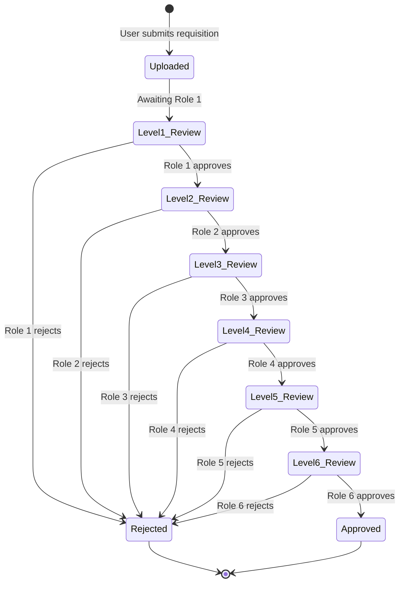
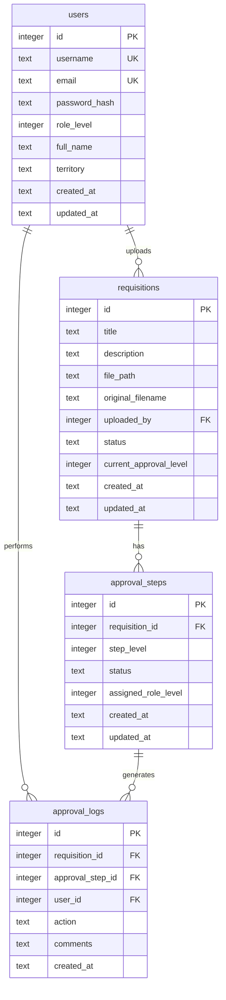
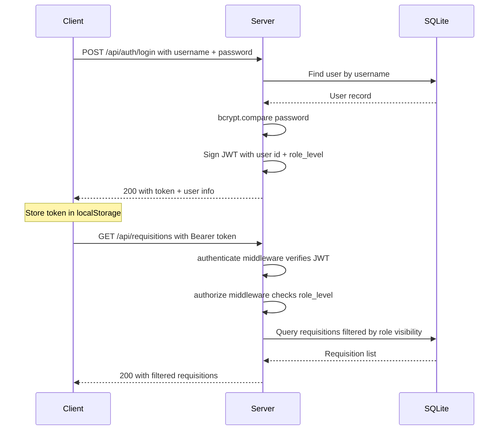

# CID Aprueba — System Architecture

> Hierarchical Requisition Approval Workflow for Corporación Infancia y Desarrollo

---

## 1. System Overview

**CID Aprueba** is a web application that manages sequential, role-based approval of project quotations and proposals. Requisitions uploaded by users must pass through a chain of **6 hierarchical approval roles** before reaching full approval status. Each role can only act on a requisition once the previous (higher-authority) role has approved it.

### Core Workflow



### Key Principles

- **Sequential gating:** Each level unlocks only after the previous level approves.
- **Visibility rules:** Users see dashboard metrics for all requisitions but can only open/act on requisitions at or below their approval level.
- **Audit trail:** Every approval or rejection is logged with timestamp, user, and optional comments.

---

## 2. Tech Stack

| Layer | Technology | Rationale |
|-------|-----------|-----------|
| **Runtime** | Node.js 20+ | Fast startup, large ecosystem, single-language stack |
| **Framework** | Express 4.x | Minimal, well-understood, flexible routing and middleware |
| **Database** | SQLite via `better-sqlite3` | Zero-config, single-file DB, synchronous API avoids callback complexity, perfect for low-to-medium concurrency |
| **Frontend** | Vanilla HTML / CSS / JS | No build step, instant reload, minimal dependencies, easy to maintain |
| **Auth** | JWT (`jsonwebtoken` + `bcrypt`) | Stateless authentication, simple role claims in token payload |
| **File uploads** | `multer` | Battle-tested multipart handling for Express |
| **Validation** | `express-validator` | Declarative input validation tied to routes |
| **Environment** | `dotenv` | Standard `.env` configuration pattern |

### Why This Stack?

The project prioritizes **speed of development**, **operational simplicity**, and **minimal infrastructure**. SQLite eliminates the need for a separate database server. Vanilla frontend avoids build tooling. The entire application can run on a single server with `node server.js`.

---

## 3. Project Directory Structure

```
cid-aprueba/
├── server.js                  # Entry point — starts Express server
├── package.json
├── .env                       # Environment variables (not committed)
├── .env.example               # Template for .env
├── ARCHITECTURE.md            # This file
├── STANDARDS.md               # Coding standards
│
├── src/
│   ├── config/
│   │   ├── database.js        # SQLite connection and initialization
│   │   └── auth.js            # JWT secret, token expiry settings
│   │
│   ├── middleware/
│   │   ├── authenticate.js    # JWT verification middleware
│   │   ├── authorize.js       # Role-based access control
│   │   ├── errorHandler.js    # Centralized error handling
│   │   └── validate.js        # Request validation wrapper
│   │
│   ├── models/
│   │   ├── User.js            # User CRUD and queries
│   │   ├── Requisition.js     # Requisition CRUD and queries
│   │   ├── ApprovalStep.js    # Approval step management
│   │   └── ApprovalLog.js     # Audit log queries
│   │
│   ├── controllers/
│   │   ├── authController.js      # Login, register, token refresh
│   │   ├── requisitionController.js  # Upload, list, detail, download
│   │   ├── approvalController.js  # Approve, reject, return
│   │   └── dashboardController.js # Metrics and summaries
│   │
│   ├── routes/
│   │   ├── auth.js
│   │   ├── requisitions.js
│   │   ├── approvals.js
│   │   └── dashboard.js
│   │
│   └── utils/
│       ├── AppError.js        # Custom error class
│       └── logger.js          # Logging utility
│
├── public/                    # Static frontend assets
│   ├── index.html             # Single-page app (login + main views)
│   ├── css/
│   │   └── styles.css         # Global styles with CID brand colors
│   ├── js/
│   │   ├── api.js             # Fetch wrapper with JWT handling
│   │   └── app.js             # Main application logic (SPA routing, views)
│   └── assets/
│       └── logo-LA-CID.svg    # CID logo
│
├── uploads/                   # Uploaded document files (gitignored)
│
├── data/                      # SQLite database file location (gitignored)
│   └── cid_aprueba.db
│
└── tests/
    ├── auth.test.js
    ├── documents.test.js
    └── approvals.test.js
```

---

## 4. Database Schema

### Entity Relationship Diagram



### Table Details

#### `users`

| Column | Type | Constraints | Description |
|--------|------|-------------|-------------|
| `id` | INTEGER | PK, AUTOINCREMENT | Unique user ID |
| `username` | TEXT | UNIQUE, NOT NULL | Login username |
| `email` | TEXT | UNIQUE, NOT NULL | User email |
| `password_hash` | TEXT | NOT NULL | bcrypt-hashed password |
| `role_level` | INTEGER | NOT NULL, CHECK 1-6 | 1 = Coordinador de Territorio, 2 = Director/a Programática, 3 = Representante Legal, 4 = Coordinador de Proyectos, 5 = Analista, 6 = Revisor |
| `full_name` | TEXT | NOT NULL | Display name |
| `is_active` | INTEGER | DEFAULT 1 | Soft-delete flag |
| `created_at` | TEXT | DEFAULT CURRENT_TIMESTAMP | |
| `updated_at` | TEXT | DEFAULT CURRENT_TIMESTAMP | |

#### `requisitions`

| Column | Type | Constraints | Description |
|--------|------|-------------|-------------|
| `id` | INTEGER | PK, AUTOINCREMENT | Unique requisition ID |
| `title` | TEXT | NOT NULL | Requisition title |
| `description` | TEXT | | Optional description |
| `file_path` | TEXT | NOT NULL | Server path to uploaded file |
| `original_filename` | TEXT | NOT NULL | Original upload filename |
| `uploaded_by` | INTEGER | FK → users.id | Uploader user ID |
| `status` | TEXT | NOT NULL | `pending`, `in_review`, `approved`, `rejected` |
| `current_approval_level` | INTEGER | DEFAULT 1 | Which role level is currently reviewing |
| `created_at` | TEXT | DEFAULT CURRENT_TIMESTAMP | |
| `updated_at` | TEXT | DEFAULT CURRENT_TIMESTAMP | |

#### `approval_steps`

| Column | Type | Constraints | Description |
|--------|------|-------------|-------------|
| `id` | INTEGER | PK, AUTOINCREMENT | |
| `requisition_id` | INTEGER | FK → requisitions.id | |
| `step_level` | INTEGER | NOT NULL, 1-6 | Which level this step represents |
| `status` | TEXT | DEFAULT `pending` | `pending`, `approved`, `rejected` |
| `assigned_role_level` | INTEGER | NOT NULL | Role level required to act |
| `created_at` | TEXT | DEFAULT CURRENT_TIMESTAMP | |
| `updated_at` | TEXT | DEFAULT CURRENT_TIMESTAMP | |

**Note:** When a requisition is uploaded, 6 `approval_steps` rows are created (one per level), all starting as `pending`.

#### `approval_logs`

| Column | Type | Constraints | Description |
|--------|------|-------------|-------------|
| `id` | INTEGER | PK, AUTOINCREMENT | |
| `requisition_id` | INTEGER | FK → requisitions.id | |
| `approval_step_id` | INTEGER | FK → approval_steps.id | |
| `user_id` | INTEGER | FK → users.id | Who performed the action |
| `action` | TEXT | NOT NULL | `approved`, `rejected` |
| `comments` | TEXT | | Optional reviewer comments |
| `created_at` | TEXT | DEFAULT CURRENT_TIMESTAMP | |

---

## 5. API Endpoints

All endpoints return JSON. Protected routes require `Authorization: Bearer <token>` header.

### Authentication

| Method | Path | Auth | Description |
|--------|------|------|-------------|
| POST | `/api/auth/login` | No | Authenticate and receive JWT |
| POST | `/api/auth/register` | Admin | Create new user account |
| GET | `/api/auth/me` | Yes | Get current user profile |

### Requisitions

| Method | Path | Auth | Description |
|--------|------|------|-------------|
| GET | `/api/requisitions` | Yes | List requisitions visible to current user |
| GET | `/api/requisitions/:id` | Yes | Get requisition detail with approval history |
| POST | `/api/requisitions` | Yes | Upload new requisition (multipart) |
| GET | `/api/requisitions/:id/download` | Yes | Download the original file |

### Approvals

| Method | Path | Auth | Description |
|--------|------|------|-------------|
| POST | `/api/approvals/:requisitionId/approve` | Yes | Approve requisition at current level |
| POST | `/api/approvals/:requisitionId/reject` | Yes | Reject requisition with comments |
| GET | `/api/approvals/:requisitionId/history` | Yes | Get full approval log for a requisition |

### Dashboard

| Method | Path | Auth | Description |
|--------|------|------|-------------|
| GET | `/api/dashboard/stats` | Yes | Aggregate metrics: total, pending, approved, rejected |
| GET | `/api/dashboard/pending` | Yes | Requisitions awaiting current user action |
| GET | `/api/dashboard/recent` | Yes | Recently processed requisitions |

---

## 6. Authentication & Authorization Flow



### JWT Payload Structure

```json
{
  "sub": 1,
  "username": "coord.territorio",
  "role_level": 1,
  "iat": 1693000000,
  "exp": 1693086400
}
```

### Authorization Rules

| Rule | Implementation |
|------|---------------|
| **View dashboard metrics** | All authenticated users |
| **View requisition list** | All authenticated users see metadata; detail access restricted by level |
| **Open requisition detail** | User role_level must be ≤ requisition current_approval_level |
| **Approve/Reject** | User role_level must equal requisition current_approval_level |
| **Upload requisition** | Coordinadores de Territorio (role_level = 1) only |
| **Register users** | Admin only (dedicated admin flag) |

---

## 7. Approval Workflow State Machine

### Requisition Status Transitions

```
UPLOADED → IN_REVIEW → APPROVED
                ↘ REJECTED
```

### Per-Step Logic

1. Requisition is uploaded → `status = 'pending'`, `current_approval_level = 1`
2. All 6 `approval_steps` are created with `status = 'pending'`
3. When Role 1 user approves:
   - `approval_steps[level=1].status = 'approved'`
   - `requisitions.current_approval_level = 2`
   - `requisitions.status = 'in_review'`
   - An `approval_logs` entry is created
4. Process repeats for levels 2–6
5. When Role 6 approves:
   - `requisitions.status = 'approved'`
   - `requisitions.current_approval_level = 7` (past all levels)
6. If **any** role rejects:
   - `requisitions.status = 'rejected'`
   - The step and all subsequent steps remain `pending`
   - An `approval_logs` entry records the rejection with comments

### Rejection Handling

Rejected requisitions are terminal — they cannot re-enter the approval flow. If a revised version is needed, the user uploads a new requisition.

---

## 8. Frontend Architecture

The frontend is a set of static HTML pages served from `/public`. JavaScript modules handle API communication and DOM manipulation.

### Page Structure

| Page | Purpose |
|------|---------|
| `index.html` | Single-page app: login, dashboard, requisition list, detail, create, profile |

### Brand Design Tokens

| Token | Value | Usage |
|-------|-------|-------|
| `--color-primary` | `#C85A2A` (Orange) | Primary buttons, active states, accents |
| `--color-secondary` | `#6B8E23` (Olive Green) | Success states, approved badges |
| `--color-dark` | `#3D5A1E` (Dark Green) | Headers, navigation, text emphasis |
| `--color-background` | `#F5F0E8` (Cream/Beige) | Page background |
| `--color-surface` | `#FFFFFF` | Cards, modals |
| `--color-error` | `#C0392B` | Rejection states, error messages |

### Client-Side Auth

- JWT stored in `localStorage`
- [`api.js`](public/js/api.js) wraps `fetch()` to auto-attach `Authorization` header
- On 401 response, redirect to login page
- Role level stored client-side to conditionally render approve/reject buttons

---

## 9. Scalability Considerations

| Concern | Approach |
|---------|----------|
| **More approval levels** | Add rows to `approval_steps` on upload; `role_level` range is configurable, not hardcoded to 6 |
| **Multiple approvers per level** | Add `assigned_user_id` to `approval_steps`; current design supports one approver per role level |
| **File storage growth** | Move from local `uploads/` to S3-compatible storage; change only `Requisition` model |
| **Database scaling** | Migrate from SQLite to PostgreSQL; `better-sqlite3` API maps cleanly to `pg` with parameterized queries |
| **Notifications** | Add email/webhook notifications in approval controller without changing workflow logic |
| **Audit compliance** | `approval_logs` table already captures full history; add export endpoint as needed |
| **Multi-tenancy** | Add `organization_id` to all tables; filter queries by org context |

---

## 10. Deployment

### Minimum Requirements

- Node.js 20+
- Writable filesystem for SQLite DB and uploads
- Single port (default: 3000)

### Startup

```bash
cp .env.example .env    # Configure secrets
npm install             # Install dependencies
node server.js          # Start server
```

### Environment Variables

| Variable | Description | Example |
|----------|-------------|---------|
| `PORT` | Server port | `3000` |
| `JWT_SECRET` | Secret for signing tokens | `a-long-random-string` |
| `JWT_EXPIRES_IN` | Token expiry | `24h` |
| `DB_PATH` | Path to SQLite file | `./data/cid_aprueba.db` |
| `UPLOAD_DIR` | Upload directory | `./uploads` |
| `MAX_FILE_SIZE` | Max upload size in bytes | `10485760` |
| `NODE_ENV` | Environment | `development` |
