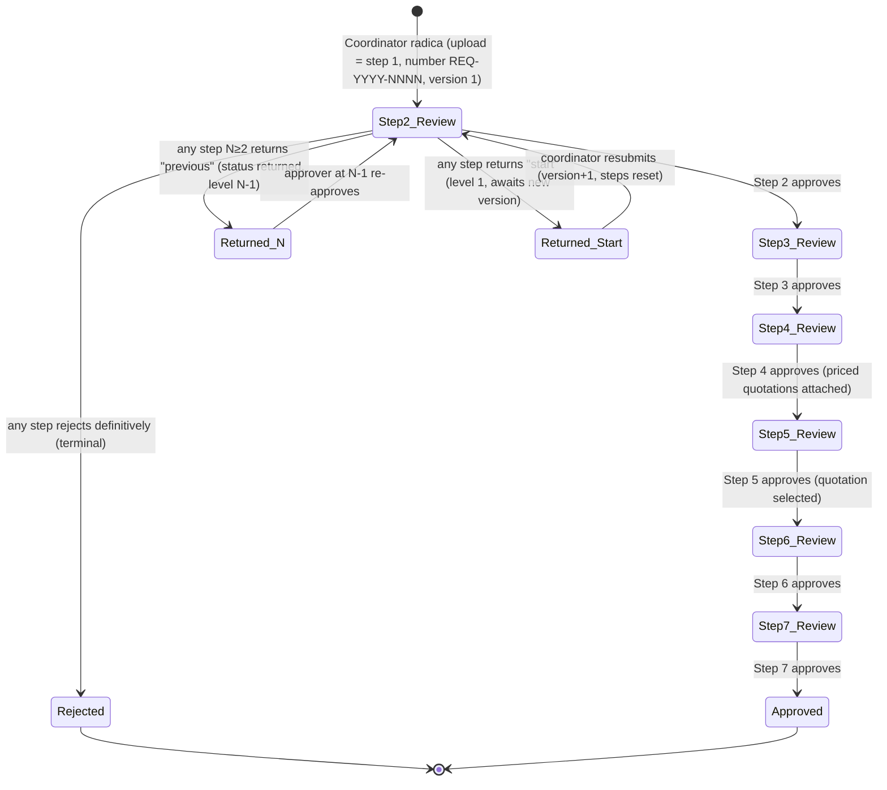
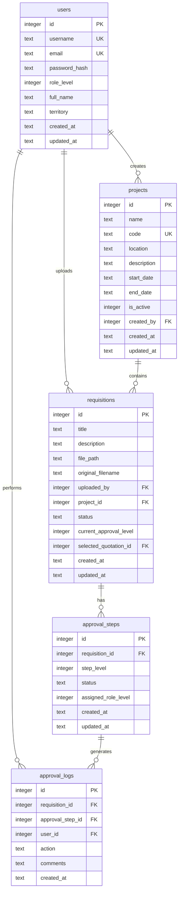
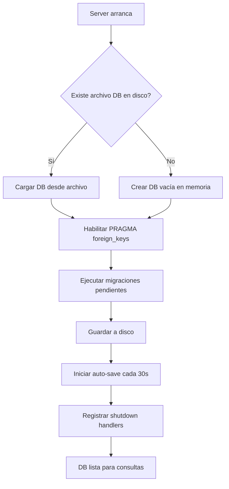
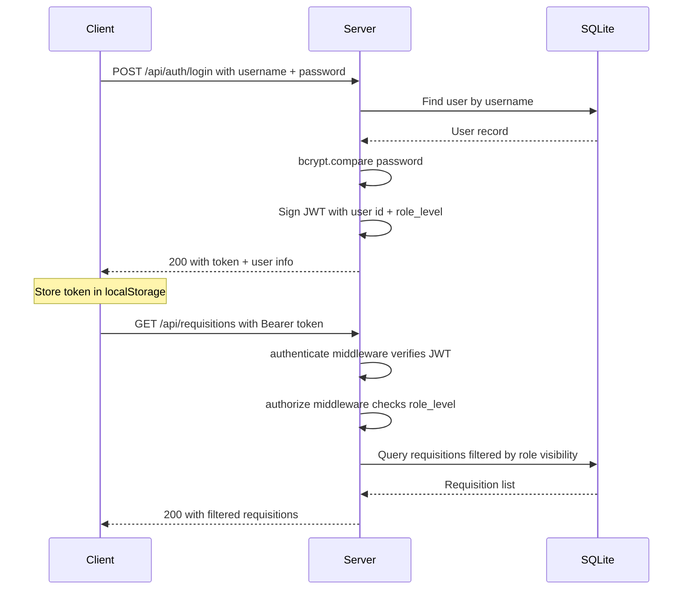

# CID Aprueba — System Architecture

> Hierarchical Requisition Approval Workflow for Corporación Infancia y Desarrollo

---

## 1. System Overview

**CID Aprueba** is a web application that manages sequential, role-based approval of project quotations and proposals. Requisitions uploaded by users must pass through a chain of **7 sequential approval steps** (mapped to **6 role levels**) before reaching full approval status. Each step can only act on a requisition once the previous step has been approved. Note that role level 3 (Representante Legal) participates at two different steps (3 and 5).

### Core Workflow



Returns and terminal rejections are available from every step 2–7; the diagram shows them once for brevity.

### Key Principles

- **Sequential gating:** Each level unlocks only after the previous level approves.
- **Visibility rules:** Users see dashboard metrics for all requisitions but can only open/act on requisitions at or below their approval level.
- **Audit trail:** Every approval or rejection is logged with timestamp, user, and optional comments.

---

## 2. Tech Stack

| Layer | Technology | Rationale |
|-------|-----------|-----------|
| **Runtime** | Node.js 20+ | Fast startup, large ecosystem, single-language stack |
| **Framework** | Express 4.x | Minimal, well-understood, flexible routing and middleware |
| **Database** | SQLite via `sql.js` (persistent) | Pure-JS SQLite (no native build), synchronous API wrapper mimics `better-sqlite3`, persistent storage at `data/cid_aprueba.db` with auto-save and atomic writes |
| **Frontend** | Vanilla HTML / CSS / JS | No build step, instant reload, minimal dependencies, easy to maintain |
| **Auth** | JWT (`jsonwebtoken` + `bcrypt`) | Stateless authentication, simple role claims in token payload |
| **File uploads** | `multer` | Battle-tested multipart handling for Express |
| **Validation** | `express-validator` | Declarative input validation tied to routes |
| **Environment** | `dotenv` | Standard `.env` configuration pattern |

### Why This Stack?

The project prioritizes **speed of development**, **operational simplicity**, and **minimal infrastructure**. SQLite via sql.js eliminates the need for a separate database server and avoids native compilation dependencies. The database file persists across restarts at `data/cid_aprueba.db` with automatic saves and atomic writes. Vanilla frontend avoids build tooling. The entire application can run on a single server with `node server.js`.

---

## 3. Project Directory Structure

```
cid-aprueba/
├── server.js                  # Entry point — starts Express server
├── package.json
├── .env                       # Environment variables (not committed)
├── .env.example               # Template for .env
├── ARCHITECTURE.md            # This file
├── STANDARDS.md               # Coding standards
│
├── src/
│   ├── config/
│   │   ├── database.js        # sql.js persistent wrapper (debounced save, re-entrant transactions)
│   │   ├── auth.js            # JWT secret, token expiry settings
│   │   ├── workflow.js        # Single source of truth: step→role map, labels, doc types (served at /api/meta)
│   │   └── migrations/        # Database migration files
│   │       ├── index.js       # Migration runner
│   │       ├── 001_initial_schema.js  # Initial 6-table schema
│   │       ├── 002_seed_users.js      # Default user seeding
│   │       └── 004_projects.js        # Projects table and requisitions.project_id
│   │
│   ├── middleware/
│   │   ├── authenticate.js    # JWT verification middleware
│   │   ├── authorize.js       # Role-based access control (applied in routes, e.g. authorize(3))
│   │   ├── errorHandler.js    # Centralized error handling; maps multer errors, deletes orphaned uploads
│   │   ├── quotationStage.js  # Guards for quotation mutations (step 4 pending, ownership chain)
│   │   ├── upload.js          # Shared multer factory (extension whitelist, size limit, UTF-8 names)
│   │   ├── validate.js        # express-validator result → 400 VALIDATION_ERROR
│   │   └── validators.js      # Reusable chains: idParam(), pagination, statusParam, getPagination()
│   │
│   ├── models/
│   │   ├── User.js            # User CRUD and queries
│   │   ├── Requisition.js     # Requisition CRUD and queries
│   │   ├── ApprovalStep.js    # Approval step management (STEP_TO_ROLE_MAP)
│   │   ├── ApprovalLog.js     # Audit log queries
│   │   ├── Quotation.js       # Quotation CRUD and queries
│   │   ├── QuotationDocument.js # Quotation supporting documents
│   │   └── Project.js         # Project CRUD and queries
│   │
│   ├── controllers/
│   │   ├── authController.js      # Login, register, token refresh
│   │   ├── requisitionController.js  # Upload, list, detail, download
│   │   ├── approvalController.js  # Approve, reject, return
│   │   ├── quotationController.js # Quotation CRUD and file management
│   │   ├── dashboardController.js # Metrics and summaries
│   │   ├── userController.js      # User management (CRUD)
│   │   └── projectController.js   # Project CRUD
│   │
│   ├── routes/
│   │   ├── auth.js
│   │   ├── requisitions.js
│   │   ├── approvals.js
│   │   ├── quotations.js
│   │   ├── dashboard.js
│   │   ├── users.js               # User management routes
│   │   └── projects.js            # Project routes
│   │
│   └── utils/
│       ├── AppError.js        # Custom error class
│       └── logger.js          # Logging utility
│
├── public/                    # Static frontend assets
│   ├── index.html             # Single-page app (login + main views)
│   ├── css/
│   │   └── styles.css         # Global styles with CID brand colors
│   ├── js/
│   │   ├── api.js             # Fetch wrapper with JWT handling
│   │   └── app.js             # Main application logic (SPA routing, views)
│   └── assets/
│       └── logo-LA-CID.svg    # CID logo
│
├── uploads/                   # Uploaded document files (gitignored)
│
├── data/                      # Database storage (gitignored)
│   ├── cid_aprueba.db         # SQLite database file
│   └── backups/               # Pre-migration backups
│
└── tests/
    ├── auth.test.js
    ├── documents.test.js
    └── approvals.test.js
```

---

## 4. Database Schema

### Entity Relationship Diagram



### Table Details

#### `users`

| Column | Type | Constraints | Description |
|--------|------|-------------|-------------|
| `id` | INTEGER | PK, AUTOINCREMENT | Unique user ID |
| `username` | TEXT | UNIQUE, NOT NULL | Login username |
| `email` | TEXT | UNIQUE, NOT NULL | User email |
| `password_hash` | TEXT | NOT NULL | bcrypt-hashed password |
| `role_level` | INTEGER | NOT NULL, CHECK 1-6 | 1 = Coordinador/a de Territorio, 2 = Director/a Programática, 3 = Representante Legal, 4 = Encargado/a de Compras, 5 = Área Financiera, 6 = Área de Compras |
| `full_name` | TEXT | NOT NULL | Display name |
| `is_active` | INTEGER | DEFAULT 1 | Soft-delete flag |
| `created_at` | TEXT | DEFAULT CURRENT_TIMESTAMP | |
| `updated_at` | TEXT | DEFAULT CURRENT_TIMESTAMP | |

#### `projects`

| Column | Type | Constraints | Description |
|--------|------|-------------|-------------|
| `id` | INTEGER | PK, AUTOINCREMENT | Unique project ID |
| `name` | TEXT | NOT NULL | Project name |
| `code` | TEXT | UNIQUE | Optional unique project code |
| `location` | TEXT | | Project location |
| `description` | TEXT | | Optional description |
| `start_date` | TEXT | | Start date (ISO 8601) |
| `end_date` | TEXT | | End date (ISO 8601) |
| `is_active` | INTEGER | DEFAULT 1 | Soft-delete flag |
| `created_by` | INTEGER | FK → users.id, NOT NULL | User who created the project |
| `created_at` | TEXT | DEFAULT CURRENT_TIMESTAMP | |
| `updated_at` | TEXT | DEFAULT CURRENT_TIMESTAMP | |

#### `requisitions`

| Column | Type | Constraints | Description |
|--------|------|-------------|-------------|
| `id` | INTEGER | PK, AUTOINCREMENT | Unique requisition ID |
| `number` | TEXT | UNIQUE | Readable number `REQ-<year>-<0001>`, sequence resets per year (migration 006) |
| `version` | INTEGER | NOT NULL, DEFAULT 1 | Current document version; incremented on resubmit |
| `return_reason` | TEXT | NULL | Comments of the latest return; cleared when re-approved/resubmitted |
| `returned_from_level` | INTEGER | NULL | Step that issued the latest return |
| `title` | TEXT | NOT NULL | Requisition title |
| `description` | TEXT | | Optional description |
| `file_path` | TEXT | NOT NULL | Server path to uploaded file |
| `original_filename` | TEXT | NOT NULL | Original upload filename |
| `uploaded_by` | INTEGER | FK → users.id | Uploader user ID |
| `project_id` | INTEGER | FK → projects.id, NULL | Associated project (optional) |
| `status` | TEXT | NOT NULL | `in_review`, `returned`, `approved`, `rejected` (`pending` legacy only) |
| `current_approval_level` | INTEGER | DEFAULT 2 | Step currently being reviewed (2–7); 1 = returned to start awaiting a new version; 8 = fully approved |
| `selected_quotation_id` | INTEGER | FK → quotations.id, NULL | The quotation selected by the Representante Legal at step 5 |
| `created_at` | TEXT | DEFAULT CURRENT_TIMESTAMP | |
| `updated_at` | TEXT | DEFAULT CURRENT_TIMESTAMP | |

#### `approval_steps`

| Column | Type | Constraints | Description |
|--------|------|-------------|-------------|
| `id` | INTEGER | PK, AUTOINCREMENT | |
| `requisition_id` | INTEGER | FK → requisitions.id | |
| `step_level` | INTEGER | NOT NULL, 1-7 | Which step this represents in the 7-step workflow |
| `status` | TEXT | DEFAULT `pending` | `pending`, `approved`, `rejected` |
| `assigned_role_level` | INTEGER | NOT NULL | Role level required to act |
| `created_at` | TEXT | DEFAULT CURRENT_TIMESTAMP | |
| `updated_at` | TEXT | DEFAULT CURRENT_TIMESTAMP | |

**Note:** When a requisition is radicada, 7 `approval_steps` rows are created: step 1 `approved` (the upload is the radicación), steps 2–7 `pending`. `assigned_role_level` comes from `STEP_TO_ROLE_MAP` in [`config/workflow.js`](src/config/workflow.js). A return resets steps ≥ target back to `pending`.

#### `requisition_versions`

| Column | Type | Constraints | Description |
|--------|------|-------------|-------------|
| `id` | INTEGER | PK, AUTOINCREMENT | |
| `requisition_id` | INTEGER | FK → requisitions.id | |
| `version` | INTEGER | NOT NULL, UNIQUE with requisition_id | 1 = original upload |
| `title`, `description` | TEXT | | Snapshot of the requisition text at that version |
| `file_path`, `original_filename` | TEXT | NOT NULL | The document of that version (never deleted) |
| `comments` | TEXT | | Coordinator's note when resubmitting |
| `created_by` | INTEGER | FK → users.id | |
| `created_at` | TEXT | DEFAULT CURRENT_TIMESTAMP | |

#### `approval_logs`

| Column | Type | Constraints | Description |
|--------|------|-------------|-------------|
| `id` | INTEGER | PK, AUTOINCREMENT | |
| `requisition_id` | INTEGER | FK → requisitions.id | |
| `approval_step_id` | INTEGER | FK → approval_steps.id | |
| `user_id` | INTEGER | FK → users.id | Who performed the action |
| `action` | TEXT | NOT NULL | `uploaded`, `approved`, `returned`, `resubmitted`, `rejected` |
| `to_level` | INTEGER | NULL | For `returned`: the step the requisition was sent back to |
| `comments` | TEXT | | Reviewer comments (required for returned/rejected) |
| `created_at` | TEXT | DEFAULT CURRENT_TIMESTAMP | |

#### `quotations` (amount columns, migration 006)

| Column | Type | Constraints | Description |
|--------|------|-------------|-------------|
| `amount` | REAL | required by the API for new rows | Quoted total in `currency`; NULL only on legacy rows |
| `currency` | TEXT | NOT NULL, DEFAULT `COP` | |
| `notes` | TEXT | | Optional notes from Encargado/a de Compras |

### Database Initialization Flow



The [`initializeDatabase()`](src/config/database.js:198) function is called once from `server.js` at startup. It:

1. **Loads from disk** if `data/cid_aprueba.db` exists, or creates a fresh in-memory database if not
2. **Runs pending migrations** via the [`runMigrations()`](src/config/migrations/index.js:26) runner — only migrations not yet recorded in `schema_migrations` are applied
3. **Starts auto-save** — an interval persists the database to disk every 30 seconds using atomic writes (temp file + `fs.renameSync`)
4. **Registers shutdown handlers** — `SIGINT`, `SIGTERM`, and `uncaughtException` all trigger a final save before exit

### Schema Migrations

The migration system uses a `schema_migrations` tracking table to record which migrations have been applied:

```sql
CREATE TABLE IF NOT EXISTS schema_migrations (
  version INTEGER PRIMARY KEY,
  name TEXT NOT NULL,
  applied_at TEXT DEFAULT (datetime('now'))
);
```

Migration files live in [`src/config/migrations/`](src/config/migrations/) and are executed in order. Before running any pending migrations, the runner creates a **backup** of the database file in `data/backups/`. Each migration runs inside its own transaction — if it fails, the transaction is rolled back and the process aborts.

| Migration | Version | Description |
|-----------|---------|-------------|
| [`001_initial_schema.js`](src/config/migrations/001_initial_schema.js) | 1 | Creates the 6 core tables (users, requisitions, approval_steps, approval_logs, quotations, quotation_documents) |
| [`002_seed_users.js`](src/config/migrations/002_seed_users.js) | 2 | Seeds 7 default users (only if users table is empty) |
| [`004_projects.js`](src/config/migrations/004_projects.js) | 4 | Creates the `projects` table and adds `project_id` column to `requisitions` |

### Data Persistence & Safety

| Mechanism | Description |
|-----------|-------------|
| **Auto-save** | Every 30 seconds, the in-memory database is exported and written to disk |
| **Transaction save** | After each explicit `db.transaction()`, the database is persisted immediately |
| **Atomic writes** | Writes go to a `.tmp` file first, then `fs.renameSync` replaces the original — prevents corruption on interrupted writes |
| **Graceful shutdown** | `SIGINT`/`SIGTERM` handlers save the database before `process.exit(0)` |
| **Pre-migration backup** | Before applying pending migrations, the DB file is copied to `data/backups/database-backup-<timestamp>.sqlite` |

---

## 5. API Endpoints

All endpoints return JSON. Protected routes require `Authorization: Bearer <token>` header.

### Authentication

| Method | Path | Auth | Description |
|--------|------|------|-------------|
| POST | `/api/auth/login` | No | Authenticate and receive JWT |
| POST | `/api/auth/register` | Admin | Create new user account |
| GET | `/api/auth/me` | Yes | Get current user profile |

### Requisitions

| Method | Path | Auth | Description |
|--------|------|------|-------------|
| GET | `/api/requisitions` | Yes | List requisitions visible to current user (paginated) |
| GET | `/api/requisitions/status/:status` | Yes | Same, filtered by status |
| GET | `/api/requisitions/export.csv` | Yes | CSV of every visible requisition (number, status, step, selected provider/amount…) |
| GET | `/api/requisitions/:id` | Yes | Detail with steps, logs, quotations and document versions |
| POST | `/api/requisitions` | Role 1 | Radicar (multipart). Completes step 1; starts at step 2 |
| POST | `/api/requisitions/:id/resubmit` | Role 1 | Radicar nueva versión after a return to step 1 (multipart) |
| GET | `/api/requisitions/:id/download` | Yes | Download the current document |
| GET | `/api/requisitions/:id/versions/:versionId/download` | Yes | Download a previous version |

### Approvals

| Method | Path | Auth | Description |
|--------|------|------|-------------|
| POST | `/api/approvals/:requisitionId/approve` | Yes | Approve at current level (`selected_quotation_id` at step 5) |
| POST | `/api/approvals/:requisitionId/return` | Yes | Send back: `{ to: 'previous' \| 'start', comments }` (comments required) |
| POST | `/api/approvals/:requisitionId/reject` | Yes | Terminal rejection with comments |
| GET | `/api/approvals/:requisitionId/history` | Yes | Full approval log for a requisition |
| GET | `/api/approvals/export.csv` | Yes | CSV audit trail of every visible requisition |

### Meta

| Method | Path | Auth | Description |
|--------|------|------|-------------|
| GET | `/api/meta` | No | Workflow constants shared with the frontend (step→role map, labels, statuses, doc types) |

### Dashboard

| Method | Path | Auth | Description |
|--------|------|------|-------------|
| GET | `/api/dashboard/stats` | Yes | Aggregate metrics: total, pending, approved, rejected |
| GET | `/api/dashboard/pending` | Yes | Requisitions awaiting current user action |
| GET | `/api/dashboard/recent` | Yes | Recently processed requisitions |

### Projects

| Method | Path | Auth | Description |
|--------|------|------|-------------|
| GET | `/api/projects` | Yes | List all active projects |
| POST | `/api/projects` | Yes | Create a new project |
| GET | `/api/projects/:id` | Yes | Get project by ID |

### User Management (Representante Legal only — role_level 3)

| Method | Path | Auth | Description |
|--------|------|------|-------------|
| GET | `/api/users` | Yes (role 3) | List all users (including inactive) |
| POST | `/api/users` | Yes (role 3) | Create a new user |
| PUT | `/api/users/:id` | Yes (role 3) | Update user details (email, name, role, territory, gender) |
| PUT | `/api/users/:id/password` | Yes (role 3) | Reset a user's password |
| PUT | `/api/users/:id/toggle` | Yes (role 3) | Toggle user active/inactive status |

---

## 6. Authentication & Authorization Flow



### JWT Payload Structure

```json
{
  "sub": 1,
  "username": "coord.territorio",
  "role_level": 1,
  "iat": 1693000000,
  "exp": 1693086400
}
```

### Authorization Rules

| Rule | Implementation |
|------|---------------|
| **View dashboard metrics** | All authenticated users |
| **View requisition list** | Filtered by `Requisition.findAll` / `findByStatus`: a requisition is visible once `current_approval_level` ≥ the lowest step assigned to the user's role, or once it is `approved`/`rejected` |
| **Open requisition detail / download / history / quotations** | Same visibility rule, enforced by `loadVisibleRequisition` in `requisitionController.js` (403 otherwise) |
| **Approve/Reject** | `STEP_TO_ROLE_MAP[current_approval_level]` must equal the user's role_level (role 3 acts at steps 3 and 5) |
| **Upload requisition** | Coordinadores de Territorio (role_level = 1) only |
| **Manage users** | Representante Legal (role_level = 3) only — see Section 7.1 |

---

### User Management (role_level 3 — Representante Legal)

Only users with `role_level === 3` (Representante Legal) can access user management features. Every endpoint in [`userController.js`](src/controllers/userController.js) checks `req.user.role_level !== 3` and throws a `403 FORBIDDEN` error if the condition is not met.

| Capability | Details |
|------------|---------|
| **List users** | Retrieves all users including inactive ones (via [`User.findAllIncludingInactive()`](src/models/User.js)) |
| **Create users** | Can create users of any role level (1–6) and any territory. Validates unique username and email. Password is hashed with `bcrypt` (salt rounds = 10) |
| **Edit users** | Can update email, full name, role level, territory, gender, and active status. Cannot change username |
| **Reset passwords** | Can reset any user's password (minimum 6 characters) |
| **Activate/Deactivate** | Toggles `is_active` flag (0/1). Cannot deactivate own account (returns `400 SELF_DEACTIVATION`) |

The frontend shows a **"Gestión de Usuarios"** tab in the navigation only when the logged-in user has `role_level === 3`.


## 7. Approval Workflow State Machine

### Role Levels vs. Workflow Steps

The system uses **6 role levels** but **7 workflow steps**. Role level 3 (Representante Legal) participates at two different steps. The mapping is defined in [`STEP_TO_ROLE_MAP`](src/models/ApprovalStep.js:8):

```javascript
const STEP_TO_ROLE_MAP = {
  1: 1, // Coordinador/a de Territorio
  2: 2, // Director/a Programática
  3: 3, // Representante Legal (primera vez)
  4: 4, // Encargado/a de Compras
  5: 3, // Representante Legal (segunda vez — selecciona cotización)
  6: 5, // Área Financiera
  7: 6, // Área de Compras
};
```

| Role Level | Role Name | Participates at Step(s) |
|------------|-----------|------------------------|
| 1 | Coordinador/a de Territorio | Step 1 |
| 2 | Director/a Programática | Step 2 |
| 3 | Representante Legal | Step 3 AND Step 5 |
| 4 | Encargado/a de Compras | Step 4 |
| 5 | Área Financiera | Step 6 |
| 6 | Área de Compras | Step 7 |

### Requisition Status Transitions

```
IN_REVIEW (step 2) → … → IN_REVIEW (step 7) → APPROVED
     ↕ RETURNED (level N-1: previous approver re-approves)
     ↕ RETURNED (level 1: coordinator resubmits a new version)
     ↘ REJECTED (terminal)
```

`pending` is kept in the CHECK constraint for legacy rows only; new requisitions are never created in that state.

### 7-Step Approval Flow

| Step | Role | Action |
|------|------|--------|
| 1 | Coordinador/a de Territorio | Radicación: the upload itself completes this step (no approval action) |
| 2 | Director/a Programática | Review + approve |
| 3 | Representante Legal | Review + approve (first time) |
| 4 | Encargado/a de Compras | Upload 1–3 quotations with supporting docs + approve |
| 5 | Representante Legal | Review quotations, **select one**, approve (second time) |
| 6 | Área Financiera | Review + approve |
| 7 | Área de Compras | Final approval |

### Per-Step Logic

1. Coordinator radica (uploads) → one transaction creates the row with `number = REQ-<year>-<seq>`, `version = 1`, `status = 'in_review'`, `current_approval_level = FIRST_APPROVAL_LEVEL (2)`; the 7 `approval_steps` (step 1 `approved`, 2–7 `pending`); version 1 in `requisition_versions`; and an `approval_logs` entry `uploaded`.
2. Steps 2–7 are approved by the role in `STEP_TO_ROLE_MAP`, with special behavior:
   - **Step 4 (Encargado/a de Compras):** attaches 1–3 quotations, each with a mandatory `amount` (COP) and the 4 supporting documents; at least one complete quotation is required to approve
   - **Step 5 (Representante Legal):** selects one quotation (`requisitions.selected_quotation_id`); auto-selected when only one exists
3. Approving step 7 → `status = 'approved'`, `current_approval_level = 8`
4. **Return** (`POST /return`, comments required) from step N:
   - `to: 'previous'` → `current_approval_level = N-1`; `to: 'start'` → `1`. From step 2 both land on 1.
   - Steps ≥ target reset to `pending`; if target ≤ 5 the quotation selection is cleared (quotations themselves are kept for rework)
   - `status = 'returned'`, `return_reason`, `returned_from_level` set; log entry `returned` with `to_level`
   - Target ≥ 2: that step's approver re-approves normally (status goes back to `in_review`, reason cleared)
   - Target 1: only the original uploader (or a coordinator of the same territory) may `POST /resubmit` with a new file → `version + 1`, new `requisition_versions` row, steps reset (step 1 approved), level 2, log `resubmitted`
5. **Reject** (`POST /reject`, comments required) is terminal: `status = 'rejected'`; nothing can be resubmitted

### Quotation Selection at Step 5

At step 5, the Representante Legal reviews the quotations attached by the Encargado/a de Compras at step 4. Each quotation has a `status` field:

| Quotation Status | Description |
|-----------------|-------------|
| `active` | Default status when created at step 4 |
| `selected` | Chosen by the Representante Legal at step 5 |
| `not_selected` | Not chosen (set automatically when another quotation is selected) |

When the Representante Legal selects a quotation:
- The selected quotation's status becomes `'selected'`
- All other quotations for the same requisition become `'not_selected'`
- `requisitions.selected_quotation_id` is set to the chosen quotation's ID
- The approve button at step 5 is only enabled after a quotation has been selected

### Returns vs. Rejection

Reviewers have three outcomes besides approving: return to the previous step (that approver reformulates and re-approves), return to the start (the coordinator radica a new version of the document, keeping the same number and full history), or reject definitively (terminal). Every version is kept in `requisition_versions` and downloadable.

### Visibility rule

A user sees a requisition once it has reached the lowest step their role owns, once it is approved/rejected, **or if they have acted on it** (so the reviewer who returned it keeps seeing it while it sits at an earlier step). Implemented once in `Requisition.visibilityClause` / `isVisibleTo` and reused by lists, detail, downloads, history and both CSV exports.

### Exports and acta

`/api/requisitions/export.csv` and `/api/approvals/export.csv` emit UTF-8 (BOM) `;`-separated CSV that Excel opens directly. The printable "Acta de aprobación" is rendered client-side at `#/requisitions/:id/acta` from the detail payload with print CSS; no server-side PDF generation.

### Seed Users

The system seeds 7 default users (via [`002_seed_users.js`](src/config/migrations/002_seed_users.js)) for testing:

| Username | Role Level | Role Name | Territory |
|----------|-----------|-----------|-----------|
| `coord.territorio` | 1 | Coordinador/a de Territorio | Chocó |
| `coord.territorio2` | 1 | Coordinador/a de Territorio | Santander |
| `dir.programatica` | 2 | Director/a Programática | — |
| `rep.legal` | 3 | Representante Legal | — |
| `enc.compras` | 4 | Encargado/a de Compras | — |
| `area.financiera` | 5 | Área Financiera | — |
| `area.compras` | 6 | Área de Compras | — |

All seed users share the default password `cid2024`.

---

## 8. Frontend Architecture

The frontend is a set of static HTML pages served from `/public`. JavaScript modules handle API communication and DOM manipulation.

### Page Structure

| Page | Purpose |
|------|---------|
| `index.html` | Single-page app: login, dashboard, requisition list, detail, create, profile, users (Gestión de Usuarios) |

> **Nota:** El formulario "Crear Requisición" ahora incluye un selector de proyecto con opción de creación en línea (popup) para asociar una requisición a un proyecto existente o nuevo.

### Brand Design Tokens

| Token | Value | Usage |
|-------|-------|-------|
| `--color-primary` | `#C85A2A` (Orange) | Primary buttons, active states, accents |
| `--color-secondary` | `#6B8E23` (Olive Green) | Success states, approved badges |
| `--color-dark` | `#3D5A1E` (Dark Green) | Headers, navigation, text emphasis |
| `--color-background` | `#F5F0E8` (Cream/Beige) | Page background |
| `--color-surface` | `#FFFFFF` | Cards, modals |
| `--color-error` | `#C0392B` | Rejection states, error messages |

### Client-Side Auth

- JWT stored in `localStorage`
- [`api.js`](public/js/api.js) wraps `fetch()` to auto-attach `Authorization` header
- On 401 response, redirect to login page
- Role level stored client-side to conditionally render approve/reject buttons

---

## 9. Scalability Considerations

| Concern | Approach |
|---------|----------|
| **More approval steps** | Add entries to `STEP_TO_ROLE_MAP` in [`ApprovalStep.js`](src/models/ApprovalStep.js:8) and update `MAX_STEP_LEVEL`; the step→role mapping is configurable, not hardcoded |
| **Multiple approvers per level** | Add `assigned_user_id` to `approval_steps`; current design supports one approver per role level |
| **File storage growth** | Move from local `uploads/` to S3-compatible storage; change only `Requisition` model |
| **Database scaling** | Migrate from SQLite to PostgreSQL; the `sql.js` wrapper API maps cleanly to `pg` with parameterized queries (see Future Migration Path below) |
| **Notifications** | Add email/webhook notifications in approval controller without changing workflow logic |
| **Audit compliance** | `approval_logs` table already captures full history; add export endpoint as needed |
| **Multi-tenancy** | Add `organization_id` to all tables; filter queries by org context |

---

## 10. Future Migration Path

The current database setup is designed for easy evolution:

| Stage | Technology | Use Case |
|-------|-----------|----------|
| **Current** | SQLite via sql.js (local file) | Development, single-server deployment, free |
| **Future** | PostgreSQL on Google Cloud SQL, Supabase, or Neon | Multi-instance, high concurrency, managed backups |

### Strategy

1. Create `src/config/database-pg.js` with the same wrapper API (`prepare`, `get`, `all`, `run`, `exec`, `transaction`)
2. Use a `DB_DRIVER` environment variable (`sqlite` or `postgres`) in [`env.js`](src/config/env.js) to select the backend
3. `require('../config/database')` resolves to the correct driver at startup

### SQL Dialect Differences to Watch

| Feature | SQLite (current) | PostgreSQL (future) |
|---------|-----------------|-------------------|
| Auto-increment | `AUTOINCREMENT` | `SERIAL` / `IDENTITY` |
| Booleans | `INTEGER` (0/1) | `BOOLEAN` nativo |
| Date/time | `TEXT` + `datetime('now')` | `TIMESTAMP` + `NOW()` |
| Upsert | `INSERT OR REPLACE` | `ON CONFLICT DO UPDATE` |
| Case sensitivity | Insensitive | Sensitive |
| Parameters | `?` positional | `$1, $2` numbered |

---

## 11. Deployment

### Minimum Requirements

- Node.js 20+
- Writable filesystem for SQLite DB and uploads
- Single port (default: 3000)

### Startup

```bash
cp .env.example .env    # Configure secrets
npm install             # Install dependencies
node server.js          # Start server
```

### Environment Variables

| Variable | Description | Example |
|----------|-------------|---------|
| `PORT` | Server port | `3000` |
| `JWT_SECRET` | Secret for signing tokens | `a-long-random-string` |
| `JWT_EXPIRES_IN` | Token expiry | `24h` |
| `DB_PATH` | Path to SQLite file | `./data/cid_aprueba.db` |
| `UPLOAD_DIR` | Upload directory | `./uploads` |
| `MAX_FILE_SIZE` | Max upload size in bytes | `10485760` |
| `NODE_ENV` | Environment | `development` |
