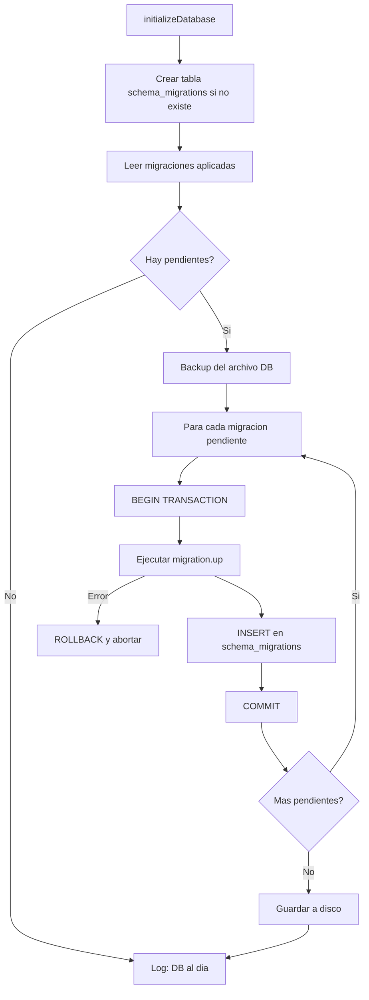
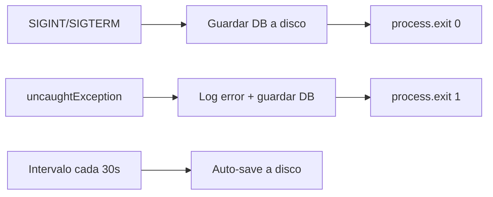

# Plan: Persistencia de Base de Datos y Sistema de Migraciones

> Corregir el bug critico que elimina la base de datos en cada reinicio del servidor, implementar persistencia real con sql.js, y crear un sistema de migraciones de esquema.

---

## Resumen del Problema

El archivo [`database.js`](../src/config/database.js:116) contiene un bug critico: en cada reinicio del servidor, ejecuta `fs.unlinkSync(dbPath)` que **elimina el archivo de base de datos completo**. Todos los datos se pierden con cada reinicio.

```javascript
// src/config/database.js lineas 116-119 (BUG CRITICO)
if (fs.existsSync(dbPath)) {
  fs.unlinkSync(dbPath);
  logger.info('Removed old database file for schema migration');
}
```

Ademas, la linea 121 siempre crea una base de datos vacia en memoria (`new SQL.Database()`) sin intentar cargar datos existentes del disco.

## Decision Tecnica

**Opcion A: Corregir la persistencia de sql.js** -- cambios minimos, mantener la misma libreria, corregir el bug de persistencia, y agregar un sistema de migraciones de esquema. No se requieren cambios en modelos ni controladores ya que la API sincrona del wrapper se mantiene identica.

### Por que no cambiar a better-sqlite3?

- `better-sqlite3` requiere compilacion nativa (node-gyp, Python, Visual Studio Build Tools) que ha causado problemas en el entorno de desarrollo actual
- sql.js funciona correctamente -- el unico problema es la logica de inicializacion
- La migracion a PostgreSQL (Google Cloud SQL) es el siguiente paso real de escalamiento

---

## 1. Arquitectura de la Solucion

### 1.1 Flujo de Inicializacion Actual vs. Propuesto

```mermaid
flowchart TD
    subgraph actual [Flujo Actual - ROTO]
        A1[Server arranca] --> A2{Existe archivo DB?}
        A2 -->|Si| A3[ELIMINAR archivo con unlinkSync]
        A2 -->|No| A4[Crear DB vacia en memoria]
        A3 --> A4
        A4 --> A5[Crear todas las tablas]
        A5 --> A6[Insertar usuarios seed]
        A6 --> A7[Guardar a disco]
        style A3 fill:#ffcdd2
    end

    subgraph propuesto [Flujo Propuesto - CORRECTO]
        B1[Server arranca] --> B2{Existe archivo DB?}
        B2 -->|Si| B3[Cargar DB desde archivo]
        B2 -->|No| B4[Crear DB vacia en memoria]
        B3 --> B5[Ejecutar migraciones pendientes]
        B4 --> B5
        B5 --> B6[Guardar a disco]
        B6 --> B7[Iniciar auto-guardado periodico]
        B7 --> B8[Registrar shutdown handlers]
        style B3 fill:#c8e6c9
        style B5 fill:#c8e6c9
        style B7 fill:#c8e6c9
        style B8 fill:#c8e6c9
    end
```



### 1.2 Flujo de Migraciones



### 1.3 Flujo de Shutdown Graceful



---

## 2. Correccion de Persistencia -- `src/config/database.js`

### 2.1 Cambios Clave

El archivo [`database.js`](../src/config/database.js) requiere una reescritura de [`initializeDatabase()`](../src/config/database.js:110):

#### Eliminar el `fs.unlinkSync` (lineas 114-119)

Eliminar completamente el bloque que borra la DB en cada reinicio.

#### Cargar DB existente desde disco

```javascript
if (fs.existsSync(dbPath)) {
  const fileBuffer = fs.readFileSync(dbPath);
  rawDb = new SQL.Database(fileBuffer);
  logger.info('Database loaded from disk');
} else {
  rawDb = new SQL.Database();
  logger.info('Created new empty database');
}
```

#### Eliminar la creacion directa de tablas (lineas 128-213)

Toda la logica de `CREATE TABLE` y `seedDefaultUsers()` se mueve al sistema de migraciones.

#### Mejorar `_saveToDisk()` con escritura atomica

```javascript
let _saving = false;

function _saveToDisk() {
  if (_saving) return;
  _saving = true;
  try {
    const data = rawDb.export();
    const buffer = Buffer.from(data);
    const tmpPath = dbPath + '.tmp';
    fs.writeFileSync(tmpPath, buffer);
    fs.renameSync(tmpPath, dbPath);
  } catch (err) {
    logger.error('Failed to persist database to disk', { stack: err.stack });
  } finally {
    _saving = false;
  }
}
```

#### Agregar auto-save periodico

```javascript
let _autoSaveInterval = null;
const AUTO_SAVE_MS = 30_000; // 30 segundos

function _startAutoSave() {
  _autoSaveInterval = setInterval(() => {
    _saveToDisk();
    logger.debug('Auto-save completed');
  }, AUTO_SAVE_MS);
  _autoSaveInterval.unref();
}
```

#### Agregar graceful shutdown

```javascript
function _registerShutdownHandlers() {
  const shutdown = (signal) => {
    logger.info(`Received ${signal}, saving database...`);
    _saveToDisk();
    if (_autoSaveInterval) clearInterval(_autoSaveInterval);
    process.exit(0);
  };
  process.on('SIGINT', () => shutdown('SIGINT'));
  process.on('SIGTERM', () => shutdown('SIGTERM'));
  process.on('uncaughtException', (err) => {
    logger.error('Uncaught exception', { stack: err.stack });
    _saveToDisk();
    process.exit(1);
  });
}
```

### 2.2 Mejorar el metodo `pragma()`

El metodo [`pragma()`](../src/config/database.js:77) actualmente ignora todo. Debe ejecutar PRAGMAs via `rawDb.run()` con manejo de errores silencioso para PRAGMAs no soportados por sql.js.

### 2.3 Guardar despues de operaciones de escritura

El auto-save periodico cada 30 segundos es suficiente para operaciones individuales. Las transacciones explicitas seguiran guardando inmediatamente (ya implementado en [`transaction()`](../src/config/database.js:81)).

---

## 3. Sistema de Migraciones

### 3.1 Tabla `schema_migrations`

```sql
CREATE TABLE IF NOT EXISTS schema_migrations (
  version INTEGER PRIMARY KEY,
  name TEXT NOT NULL,
  applied_at TEXT DEFAULT (datetime('now'))
);
```

### 3.2 Estructura de Archivos

```
src/config/migrations/
+-- index.js              # Migration runner
+-- 001_initial_schema.js # Esquema completo de las 6 tablas
+-- 002_seed_users.js     # 7 usuarios por defecto
```

### 3.3 Migration Runner -- `src/config/migrations/index.js`

Responsabilidades:
1. Crear tabla `schema_migrations` si no existe
2. Leer versiones ya aplicadas
3. Filtrar migraciones pendientes
4. Ejecutar cada una en una transaccion individual
5. Registrar la version en `schema_migrations` al completar
6. Hacer ROLLBACK y abortar si alguna falla

### 3.4 Migracion 001 -- Esquema Inicial

Contiene las 6 tablas actuales extraidas de [`database.js`](../src/config/database.js:128):
- `users` -- con campos gender, territory, is_active
- `requisitions` -- con status check constraint y current_approval_level
- `approval_steps` -- con step_level check 1-6
- `approval_logs` -- con foreign keys a requisitions, approval_steps, users
- `quotations` -- con foreign keys a requisitions, users
- `quotation_documents` -- con doc_type check constraint y UNIQUE(quotation_id, doc_type)

Todas con `CREATE TABLE IF NOT EXISTS` para idempotencia.

### 3.5 Migracion 002 -- Usuarios Seed

Inserta los 7 usuarios por defecto **solo si la tabla esta vacia** (guard clause):

| username | role_level | territory |
|----------|-----------|-----------|
| coord.territorio | 1 | Choco |
| coord.territorio2 | 1 | Santander |
| dir.programatica | 2 | null |
| rep.legal | 3 | null |
| enc.compras | 4 | null |
| analista | 5 | null |
| revisor | 6 | null |

Password: `bcrypt.hashSync('cid2024', 10)`

### 3.6 Convencion para Futuras Migraciones

| Campo | Formato | Ejemplo |
|-------|---------|---------|
| Archivo | `NNN_nombre_descriptivo.js` | `003_add_notifications_table.js` |
| `version` | Entero secuencial | `3` |
| `name` | snake_case descriptivo | `add_notifications_table` |
| `up(rawDb)` | Funcion que recibe instancia sql.js | Ejecuta SQL directamente |

**Reglas:**
- Cada migracion debe ser **idempotente** cuando sea posible
- Las migraciones **nunca se modifican** despues de ser aplicadas en produccion
- Para revertir cambios, crear una nueva migracion
- Los datos seed solo se insertan si la tabla esta vacia

---

## 4. Seguridad de Datos

### 4.1 Escritura Atomica

Escribir a archivo temporal + `fs.renameSync` garantiza que el archivo DB nunca queda corrupto por una escritura interrumpida.

### 4.2 Backup Antes de Migraciones

```javascript
if (pending.length > 0 && fs.existsSync(dbPath)) {
  const backupPath = dbPath + '.backup-' + Date.now();
  fs.copyFileSync(dbPath, backupPath);
  logger.info(`Database backup created at ${backupPath}`);
}
```

### 4.3 Auto-Save Periodico

| Evento | Accion |
|--------|--------|
| Despues de cada `transaction()` | Guardar inmediatamente |
| Cada 30 segundos | Auto-save periodico |
| SIGINT / SIGTERM | Guardar antes de salir |
| uncaughtException | Intentar guardar antes de salir |

### 4.4 WAL Mode

sql.js no soporta WAL porque opera en memoria. El auto-save periodico + guardado en transacciones es el equivalente funcional.

---

## 5. Estructura Final de `database.js`

```javascript
const initializeDatabase = async () => {
  const initSqlJs = require('sql.js');
  SQL = await initSqlJs();

  // 1. Cargar DB existente o crear nueva
  if (fs.existsSync(dbPath)) {
    const fileBuffer = fs.readFileSync(dbPath);
    rawDb = new SQL.Database(fileBuffer);
  } else {
    rawDb = new SQL.Database();
  }

  // 2. Habilitar foreign keys
  rawDb.run('PRAGMA foreign_keys = ON');

  // 3. Ejecutar migraciones pendientes
  const { runMigrations } = require('./migrations');
  runMigrations(rawDb);

  // 4. Guardar a disco
  _saveToDisk();

  // 5. Iniciar auto-save y shutdown handlers
  _startAutoSave();
  _registerShutdownHandlers();
};
```

**Se elimina:** `fs.unlinkSync`, todas las sentencias `CREATE TABLE`, `seedDefaultUsers()`

**Se agrega:** Carga desde disco, migration runner, auto-save, shutdown handlers, escritura atomica

---

## 6. Archivos a Crear/Modificar

### Archivos Nuevos

| Archivo | Proposito |
|---------|-----------|
| `src/config/migrations/index.js` | Migration runner |
| `src/config/migrations/001_initial_schema.js` | Esquema de las 6 tablas |
| `src/config/migrations/002_seed_users.js` | 7 usuarios por defecto |

### Archivos Modificados

| Archivo | Cambio |
|---------|--------|
| [`src/config/database.js`](../src/config/database.js) | Reescritura completa de `initializeDatabase()` |
| [`ARCHITECTURE.md`](../ARCHITECTURE.md) | Actualizar Tech Stack (sql.js), agregar seccion migraciones |
| [`STANDARDS.md`](../STANDARDS.md) | Agregar convenciones de migraciones |

### Archivos NO Modificados

La API del wrapper `db` se mantiene identica, por lo tanto **no cambian**: todos los modelos, controladores, rutas, [`server.js`](../server.js), [`env.js`](../src/config/env.js), ni el frontend.

---

## 7. Ruta de Migracion Futura: SQLite a PostgreSQL

### 7.1 Cuando Migrar

Migrar a PostgreSQL (Google Cloud SQL) cuando se necesite concurrencia multi-instancia, volumen >1GB, features avanzadas, o entorno sin filesystem persistente.

### 7.2 Diferencias de Dialecto SQL

| Feature | SQLite | PostgreSQL |
|---------|--------|------------|
| Auto-increment | `AUTOINCREMENT` | `SERIAL` / `IDENTITY` |
| Booleanos | `INTEGER` (0/1) | `BOOLEAN` nativo |
| Fecha/hora | `TEXT` + `datetime('now')` | `TIMESTAMP` + `NOW()` |
| UPSERT | `INSERT OR REPLACE` | `ON CONFLICT DO UPDATE` |
| Case sensitivity | Insensitive | Sensitive |
| Parametros | `?` posicional | `$1, $2` numerados |

### 7.3 Estrategia

1. Crear `src/config/database-pg.js` con la misma API del wrapper
2. Variable de entorno `DB_DRIVER=sqlite|postgres` en [`env.js`](../src/config/env.js)
3. `require('../config/database')` resuelve al driver correcto

---

## 8. Orden de Implementacion

1. **Crear directorio** `src/config/migrations/`
2. **Crear migracion 001** -- Esquema inicial con las 6 tablas
3. **Crear migracion 002** -- Seed de usuarios por defecto
4. **Crear migration runner** -- `src/config/migrations/index.js`
5. **Reescribir `database.js`** -- Eliminar bug, cargar desde disco, integrar migraciones, auto-save, shutdown
6. **Probar** -- Reiniciar servidor multiples veces, verificar persistencia
7. **Actualizar `ARCHITECTURE.md`** -- Reflejar sql.js y migraciones
8. **Actualizar `STANDARDS.md`** -- Convenciones de migraciones

---

## 9. Verificacion

### 9.1 Pruebas Manuales

| # | Escenario | Resultado Esperado |
|---|-----------|-------------------|
| 1 | Primer arranque sin archivo DB | Se crea DB, migraciones 001+002, 7 usuarios |
| 2 | Segundo arranque con archivo DB | Carga existente, sin migraciones, datos persisten |
| 3 | Crear requisicion, reiniciar | La requisicion sigue existiendo |
| 4 | Login despues de reinicio | Login exitoso, datos intactos |
| 5 | Agregar migracion 003, reiniciar | Solo ejecuta 003 |
| 6 | Ctrl+C | DB se guarda antes de salir |
| 7 | Verificar `.backup-*` | Backup creado antes de migraciones |

### 9.2 Verificacion de Integridad

```bash
sqlite3 data/database.sqlite ".tables"
sqlite3 data/database.sqlite "SELECT * FROM schema_migrations"
sqlite3 data/database.sqlite "SELECT id, username, role_level FROM users"
```

---

## 10. Consideraciones de Seguridad

1. **Archivo DB fuera del repositorio** -- ya en `.gitignore` (`data/`)
2. **Backups en `data/`** -- archivos `.backup-*` tambien ignorados por git
3. **Passwords de seed** -- generados con `bcrypt.hashSync('cid2024', 10)`, cambiar en produccion
4. **Escritura atomica** -- archivo `.tmp` se limpia por `renameSync`; si el proceso muere entre `writeFileSync` y `renameSync`, el DB original permanece intacto
5. **Permisos** -- solo el usuario del proceso Node.js debe tener acceso al directorio `data/`
6. **No exponer DB** -- el directorio `data/` no esta servido por `express.static()`
