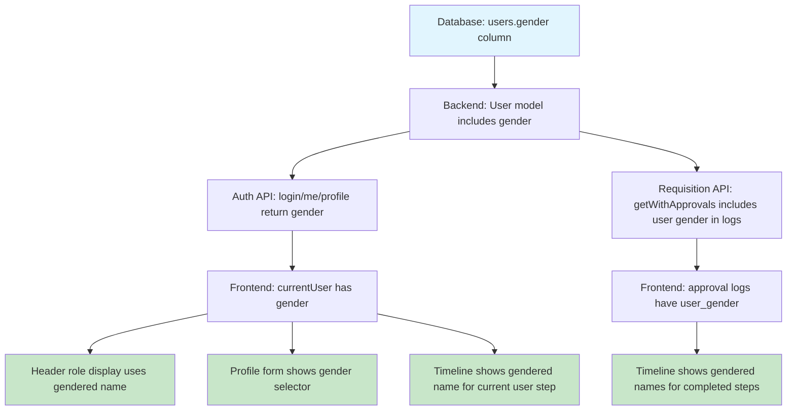

# Plan: Gender-Aware Role Names

## Summary

Replace the `@` symbol in role names (e.g., "Encargad@ de Compras") with proper gendered forms based on a user-selectable gender preference. Each user can choose Masculino, Femenino, or "Prefiero no decir" (default). The gender affects how role names display for ALL users across the entire app — header, profile, approval timeline, requisition lists, etc.

## Gender Options

| Value | Label | Example Role Names |
|-------|-------|--------------------|
| `M` | Masculino | Coordinador de Territorio, Director Programático, Encargado de Compras |
| `F` | Femenino | Coordinadora de Territorio, Directora Programática, Encargada de Compras |
| `null` | Prefiero no decir (default) | Coordinador/a de Territorio, Director/a Programática, Encargado/a de Compras |

## Role Name Mapping

| Level | Masculine | Feminine | Neutral/Default |
|-------|-----------|----------|-----------------|
| 1 | Coordinador de Territorio | Coordinadora de Territorio | Coordinador/a de Territorio |
| 2 | Director Programático | Directora Programática | Director/a Programática |
| 3 | Representante Legal | Representante Legal | Representante Legal |
| 4 | Encargado de Compras | Encargada de Compras | Encargado/a de Compras |
| 5 | Analista | Analista | Analista |
| 6 | Revisor | Revisora | Revisor/a |

## Architecture



## Data Flow for Timeline

The approval timeline currently calls `levelLabel(step.step_level)` which only knows the level number, not the user. To show gendered names:

1. **Completed steps** — The approval_logs already JOIN with users. We add `u.gender AS user_gender` to the query. The frontend uses the log's `user_gender` to pick the right role name variant.

2. **Current/pending steps** — For the step at `current_approval_level`, we don't know which specific user will act. Two options:
   - Use the neutral/default form for pending steps
   - If the current user IS the one who should act at this level, use their gender

3. **Header & Profile** — Use `currentUser.gender` directly.

## Changes by File

### Backend

#### `src/config/database.js`
- Add `gender TEXT DEFAULT NULL CHECK(gender IN ('M', 'F'))` to users table
- Update seed data: set gender to `null` for all default users

#### `src/models/User.js`
- Add `gender` to all SELECT field lists in `findById`, `findAll`, `findByRoleLevel`, `findByTerritory`
- Add `gender` handling in `update()` method

#### `src/controllers/authController.js`
- Include `gender` in login response `data.user` object
- Include `gender` in `updateProfile` — accept and save it
- Include `gender` in token payload (optional, for convenience)

#### `src/routes/auth.js`
- Add validation for `gender` field in PUT `/profile`: `body('gender').optional({nullable: true}).isIn(['M', 'F'])`

#### `src/models/Requisition.js`
- In `getWithApprovals()`, update the approval_logs query to include `u.gender AS user_gender`

### Frontend

#### `public/js/app.js`
- Replace `ROLE_NAMES` object with `ROLE_NAMES_GENDERED` — a nested structure:
  ```js
  const ROLE_NAMES_GENDERED = {
    1: { M: 'Coordinador de Territorio', F: 'Coordinadora de Territorio', default: 'Coordinador/a de Territorio' },
    2: { M: 'Director Programático', F: 'Directora Programática', default: 'Director/a Programática' },
    3: { default: 'Representante Legal' },
    4: { M: 'Encargado de Compras', F: 'Encargada de Compras', default: 'Encargado/a de Compras' },
    5: { default: 'Analista' },
    6: { M: 'Revisor', F: 'Revisora', default: 'Revisor/a' },
  };
  ```
- Update `roleName(level)` → `roleName(level, gender)` — picks the right variant
- Update `levelLabel(level)` → `levelLabel(level, gender)` — same
- Update `roleDisplay(user)` — pass `user.gender`
- Update `showApp()` header display — use `currentUser.gender`
- Update `renderProfile()` — add gender `<select>` with 3 options
- Update `handleProfileSave()` — send `gender` to API
- Update `renderRequisitionDetail()`:
  - "Nivel actual" field: use neutral form (no specific user) or currentUser gender if they match
  - Approval timeline: for completed steps with logs, use `stepLog.user_gender`; for pending steps, use neutral
  - Approval action panel title: use `currentUser.gender`
- Update `renderRequisitions()` table: "Nivel" column uses neutral form (no user context)

#### `public/index.html`
- Bump cache-busting version from `?v=3` to `?v=4`
