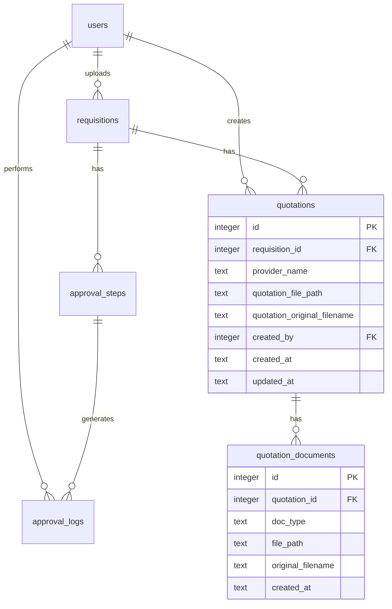
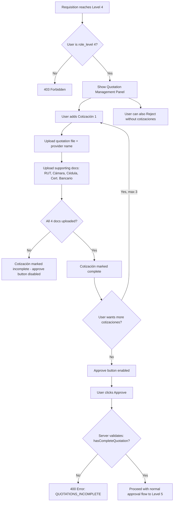

# Cotizaciones (Quotation System) — Technical Design

> Architecture design for the Encargad@ de Compras quotation attachment feature at approval step 4.

---

## 1. Overview

When a requisition reaches **approval level 4** (Encargad@ de Compras / Coordinador de Proyectos), the approver must attach **1–3 cotizaciones (quotations)** from different providers before they can approve. Each cotización consists of:

- **Quotation file** (the actual quote document)
- **Provider name** (text)
- **4 supporting documents:**
  - RUT (tax ID)
  - Cámara de Comercio (chamber of commerce certificate)
  - Cédula (ID card)
  - Certificado Bancario (bank certificate)

The approve button at step 4 is **blocked** until at least 1 complete cotización (quotation file + all 4 supporting docs) is attached.

---

## 2. Database Schema

### 2.1 New Tables

Two new tables following the existing `snake_case` naming convention:

```sql
CREATE TABLE IF NOT EXISTS quotations (
  id INTEGER PRIMARY KEY AUTOINCREMENT,
  requisition_id INTEGER NOT NULL,
  provider_name TEXT NOT NULL,
  quotation_file_path TEXT NOT NULL,
  quotation_original_filename TEXT NOT NULL,
  created_by INTEGER NOT NULL,
  created_at TEXT DEFAULT (datetime('now')),
  updated_at TEXT DEFAULT (datetime('now')),
  FOREIGN KEY (requisition_id) REFERENCES requisitions(id),
  FOREIGN KEY (created_by) REFERENCES users(id)
);

CREATE TABLE IF NOT EXISTS quotation_documents (
  id INTEGER PRIMARY KEY AUTOINCREMENT,
  quotation_id INTEGER NOT NULL,
  doc_type TEXT NOT NULL CHECK (doc_type IN ('rut', 'camara_comercio', 'cedula', 'certificado_bancario')),
  file_path TEXT NOT NULL,
  original_filename TEXT NOT NULL,
  created_at TEXT DEFAULT (datetime('now')),
  FOREIGN KEY (quotation_id) REFERENCES quotations(id)
);
```

### 2.2 Updated ER Diagram



### 2.3 Design Rationale

- **Two tables instead of one**: Separating `quotations` from `quotation_documents` keeps the schema normalized. Each quotation has exactly 4 supporting docs, but using a separate table with a `doc_type` discriminator is cleaner than 8 file columns on the quotation row.
- **`created_by`** on `quotations`: Tracks which user (should always be role_level 4) attached the quotation.
- **`doc_type` CHECK constraint**: Enforces only the 4 valid document types at the database level.
- **No `updated_at` on `quotation_documents`**: These are immutable once uploaded; to replace a document, delete and re-upload.

---

## 3. File Storage Organization

### 3.1 Directory Structure

```
uploads/
├── <timestamp>-<random>.<ext>          # Existing requisition files (flat)
└── quotations/
    └── <requisition_id>/
        └── <quotation_id>/
            ├── cotizacion-<timestamp>-<random>.<ext>
            ├── rut-<timestamp>-<random>.<ext>
            ├── camara_comercio-<timestamp>-<random>.<ext>
            ├── cedula-<timestamp>-<random>.<ext>
            └── certificado_bancario-<timestamp>-<random>.<ext>
```

### 3.2 Naming Convention

Files are prefixed with their `doc_type` for easy identification on disk:
- `cotizacion-1693000000-123456789.pdf`
- `rut-1693000000-987654321.pdf`

This follows the existing pattern in [`requisitions.js`](../src/routes/requisitions.js:29) where filenames use `${Date.now()}-${Math.round(Math.random() * 1e9)}${ext}`.

### 3.3 Multer Configuration

A new multer instance configured for quotation uploads, reusing the same `ALLOWED_EXTENSIONS` and `maxFileSize` from [`config/env.js`](../src/config/env.js:20). The `destination` callback dynamically creates the `quotations/<requisition_id>/<quotation_id>/` subdirectory.

---

## 4. New/Modified Models

### 4.1 New: `src/models/Quotation.js`

Following the existing model pattern (plain object with static methods, as seen in [`Requisition.js`](../src/models/Requisition.js:1)):

```javascript
const db = require('../config/database');

const Quotation = {
  findById(id) {
    return db.prepare(`
      SELECT q.*, u.full_name AS creator_name
      FROM quotations q
      JOIN users u ON q.created_by = u.id
      WHERE q.id = ?
    `).get(id);
  },

  findByRequisition(requisitionId) {
    return db.prepare(`
      SELECT q.*, u.full_name AS creator_name
      FROM quotations q
      JOIN users u ON q.created_by = u.id
      WHERE q.requisition_id = ?
      ORDER BY q.created_at ASC
    `).all(requisitionId);
  },

  create({ requisitionId, providerName, filePath, originalFilename, createdBy }) {
    const result = db.prepare(`
      INSERT INTO quotations (requisition_id, provider_name, quotation_file_path, quotation_original_filename, created_by)
      VALUES (?, ?, ?, ?, ?)
    `).run(requisitionId, providerName, filePath, originalFilename, createdBy);
    return Quotation.findById(result.lastInsertRowid);
  },

  delete(id) {
    db.prepare('DELETE FROM quotation_documents WHERE quotation_id = ?').run(id);
    db.prepare('DELETE FROM quotations WHERE id = ?').run(id);
  },

  countByRequisition(requisitionId) {
    const row = db.prepare(
      'SELECT COUNT(*) as count FROM quotations WHERE requisition_id = ?'
    ).get(requisitionId);
    return row.count;
  },

  getWithDocuments(id) {
    const quotation = Quotation.findById(id);
    if (!quotation) return null;
    quotation.documents = QuotationDocument.findByQuotation(id);
    return quotation;
  },

  findByRequisitionWithDocuments(requisitionId) {
    const quotations = Quotation.findByRequisition(requisitionId);
    for (const q of quotations) {
      q.documents = QuotationDocument.findByQuotation(q.id);
    }
    return quotations;
  },

  /**
   * Check if a requisition has at least 1 complete quotation
   * (quotation file + all 4 supporting documents).
   */
  hasCompleteQuotation(requisitionId) {
    const quotations = Quotation.findByRequisitionWithDocuments(requisitionId);
    return quotations.some((q) => {
      const docTypes = q.documents.map((d) => d.doc_type);
      return (
        docTypes.includes('rut') &&
        docTypes.includes('camara_comercio') &&
        docTypes.includes('cedula') &&
        docTypes.includes('certificado_bancario')
      );
    });
  },
};
```

### 4.2 New: `src/models/QuotationDocument.js`

```javascript
const db = require('../config/database');

const QuotationDocument = {
  findByQuotation(quotationId) {
    return db.prepare(`
      SELECT * FROM quotation_documents
      WHERE quotation_id = ?
      ORDER BY doc_type ASC
    `).all(quotationId);
  },

  findByQuotationAndType(quotationId, docType) {
    return db.prepare(`
      SELECT * FROM quotation_documents
      WHERE quotation_id = ? AND doc_type = ?
    `).get(quotationId, docType);
  },

  create({ quotationId, docType, filePath, originalFilename }) {
    const result = db.prepare(`
      INSERT INTO quotation_documents (quotation_id, doc_type, file_path, original_filename)
      VALUES (?, ?, ?, ?)
    `).run(quotationId, docType, filePath, originalFilename);
    return db.prepare('SELECT * FROM quotation_documents WHERE id = ?').get(result.lastInsertRowid);
  },

  delete(id) {
    db.prepare('DELETE FROM quotation_documents WHERE id = ?').run(id);
  },

  deleteByQuotationAndType(quotationId, docType) {
    db.prepare(
      'DELETE FROM quotation_documents WHERE quotation_id = ? AND doc_type = ?'
    ).run(quotationId, docType);
  },
};
```

### 4.3 Modified: `src/models/Requisition.js`

Add quotation data to [`getWithApprovals()`](../src/models/Requisition.js:89):

```javascript
// Inside getWithApprovals(id):
const Quotation = require('./Quotation');

// After fetching approvalSteps and approvalLogs, add:
const quotations = Quotation.findByRequisitionWithDocuments(id);

return {
  ...requisition,
  approval_steps: approvalSteps,
  approval_logs: approvalLogs,
  quotations,  // NEW
};
```

---

## 5. New/Modified API Endpoints

### 5.1 New: Quotation Routes (`src/routes/quotations.js`)

Mounted at `/api/requisitions/:requisitionId/quotations` in [`app.js`](../src/app.js:52).

| Method | Path | Auth | Description |
|--------|------|------|-------------|
| GET | `/api/requisitions/:requisitionId/quotations` | Yes | List all quotations with documents for a requisition |
| POST | `/api/requisitions/:requisitionId/quotations` | Yes | Create a new quotation (multipart: provider_name + quotation file) |
| DELETE | `/api/requisitions/:requisitionId/quotations/:quotationId` | Yes | Delete a quotation and all its documents |
| POST | `/api/requisitions/:requisitionId/quotations/:quotationId/documents` | Yes | Upload a supporting document (multipart: doc_type + file) |
| DELETE | `/api/requisitions/:requisitionId/quotations/:quotationId/documents/:docType` | Yes | Delete a specific supporting document |
| GET | `/api/requisitions/:requisitionId/quotations/:quotationId/download/:fileType` | Yes | Download a quotation file or supporting document |

### 5.2 Endpoint Details

#### `POST /api/requisitions/:requisitionId/quotations`

**Request:** `multipart/form-data`
- `provider_name` (string, required, max 255 chars)
- `file` (file, required — the quotation document)

**Authorization:** User must be `role_level === 4` AND requisition must be at `current_approval_level === 4` AND status must be `pending` or `in_review`.

**Validation:**
- Requisition exists and is at level 4
- User is role_level 4
- Max 3 quotations per requisition (check `Quotation.countByRequisition`)
- File type and size within existing constraints

**Response:**
```json
{
  "success": true,
  "data": {
    "quotation": {
      "id": 1,
      "requisition_id": 5,
      "provider_name": "Proveedor ABC",
      "quotation_file_path": "uploads/quotations/5/1/cotizacion-...",
      "quotation_original_filename": "cotizacion_abc.pdf",
      "documents": []
    }
  },
  "message": "Cotización creada exitosamente"
}
```

#### `POST /api/requisitions/:requisitionId/quotations/:quotationId/documents`

**Request:** `multipart/form-data`
- `doc_type` (string, required — one of: `rut`, `camara_comercio`, `cedula`, `certificado_bancario`)
- `file` (file, required)

**Validation:**
- Quotation exists and belongs to the requisition
- `doc_type` is valid
- If a document of this type already exists for this quotation, replace it (delete old file, insert new)
- User is role_level 4

**Response:**
```json
{
  "success": true,
  "data": {
    "document": {
      "id": 3,
      "quotation_id": 1,
      "doc_type": "rut",
      "file_path": "uploads/quotations/5/1/rut-...",
      "original_filename": "rut_proveedor_abc.pdf"
    }
  },
  "message": "Documento subido exitosamente"
}
```

#### `GET /api/requisitions/:requisitionId/quotations/:quotationId/download/:fileType`

**`fileType` values:** `quotation`, `rut`, `camara_comercio`, `cedula`, `certificado_bancario`

Serves the file via `res.download()`, following the pattern in [`requisitionController.download()`](../src/controllers/requisitionController.js:118).

### 5.3 Modified: Approval Endpoint

In [`approvalController.approve()`](../src/controllers/approvalController.js:11), add a gate check when `current_approval_level === 4`:

```javascript
// After existing authorization checks, before the transaction:
if (requisition.current_approval_level === 4) {
  const Quotation = require('../models/Quotation');
  if (!Quotation.hasCompleteQuotation(requisitionId)) {
    throw new AppError(
      'Debe adjuntar al menos una cotización completa (con todos los documentos de soporte) antes de aprobar',
      400,
      'QUOTATIONS_INCOMPLETE',
    );
  }
}
```

### 5.4 Route Registration

In [`app.js`](../src/app.js:52), add the new route:

```javascript
const quotationRoutes = require('./routes/quotations');
// Nested under requisitions
app.use('/api/requisitions', quotationRoutes);
```

---

## 6. New Controller: `src/controllers/quotationController.js`

Following the existing controller pattern (thin layer, delegates to models):

```javascript
const quotationController = {
  list(req, res) { /* ... */ },
  create(req, res) { /* ... */ },
  deleteQuotation(req, res) { /* ... */ },
  uploadDocument(req, res) { /* ... */ },
  deleteDocument(req, res) { /* ... */ },
  downloadFile(req, res) { /* ... */ },
};
```

**Authorization middleware** applied to all mutating endpoints: checks `req.user.role_level === 4` and that the requisition is at `current_approval_level === 4`.

---

## 7. Modified Approval Flow

### 7.1 Flow Diagram



### 7.2 Key Rules

1. **Approve is blocked** at step 4 until `Quotation.hasCompleteQuotation()` returns `true`
2. **Reject is NOT blocked** — the Encargad@ de Compras can reject without attaching quotations (they may reject for other reasons)
3. **Max 3 quotations** per requisition — enforced at API level
4. **Min 1 complete quotation** to approve — enforced both client-side (disable button) and server-side (throw `AppError`)
5. **Quotations are immutable after approval** — once step 4 is approved, quotation endpoints return 400 for any mutations
6. **All authenticated users** can view/download quotation files for requisitions they have access to
7. **Only role_level 4** can create/delete quotations and upload supporting documents

---

## 8. Frontend UI Design

### 8.1 Requisition Detail View — Quotation Panel

When `currentUser.role_level === 4` AND `requisition.current_approval_level === 4` AND status is `pending` or `in_review`, the requisition detail view shows a **Cotizaciones** panel between the requisition info and the approval action panel.

#### Layout Wireframe

```
┌─────────────────────────────────────────────────────────────┐
│  ← Volver a requisiciones                                   │
├─────────────────────────────────────────────────────────────┤
│                                                             │
│  REQUISITION INFO (existing)                                │
│  Title, Status, Level, Uploader, File, Dates                │
│                                                             │
├─────────────────────────────────────────────────────────────┤
│                                                             │
│  ┌─── COTIZACIONES ──────────────────────────────────────┐  │
│  │                                                       │  │
│  │  [+ Agregar Cotización]  (hidden if 3 already exist)  │  │
│  │                                                       │  │
│  │  ┌─ Cotización 1: Proveedor ABC ──── [✓ Completa] ─┐ │  │
│  │  │  📄 cotizacion_abc.pdf          [Descargar] [✕]  │ │  │
│  │  │  ─────────────────────────────────────────────── │ │  │
│  │  │  Documentos de soporte:                          │ │  │
│  │  │  ✅ RUT: rut_abc.pdf            [Descargar] [✕]  │ │  │
│  │  │  ✅ Cámara de Comercio: cam.pdf [Descargar] [✕]  │ │  │
│  │  │  ✅ Cédula: cedula.pdf          [Descargar] [✕]  │ │  │
│  │  │  ✅ Cert. Bancario: cert.pdf    [Descargar] [✕]  │ │  │
│  │  └──────────────────────────────────────────────────┘ │  │
│  │                                                       │  │
│  │  ┌─ Cotización 2: Proveedor XYZ ── [⚠ Incompleta] ┐ │  │
│  │  │  📄 cotizacion_xyz.pdf          [Descargar] [✕]  │ │  │
│  │  │  ─────────────────────────────────────────────── │ │  │
│  │  │  Documentos de soporte:                          │ │  │
│  │  │  ✅ RUT: rut_xyz.pdf            [Descargar] [✕]  │ │  │
│  │  │  ❌ Cámara de Comercio          [Subir archivo]  │ │  │
│  │  │  ✅ Cédula: ced_xyz.pdf         [Descargar] [✕]  │ │  │
│  │  │  ❌ Cert. Bancario              [Subir archivo]  │ │  │
│  │  └──────────────────────────────────────────────────┘ │  │
│  │                                                       │  │
│  └───────────────────────────────────────────────────────┘  │
│                                                             │
├─────────────────────────────────────────────────────────────┤
│                                                             │
│  APPROVAL PANEL (existing, modified)                        │
│  Comentarios: [________________]                            │
│  [Aprobar ✓] [Rechazar ✕]                                  │
│                                                             │
│  ⚠ "Debe completar al menos una cotización para aprobar"   │
│  (shown when no complete quotation exists)                  │
│                                                             │
└─────────────────────────────────────────────────────────────┘
```

### 8.2 Add Quotation Flow

Clicking **"+ Agregar Cotización"** expands an inline form:

```
┌─ Nueva Cotización ─────────────────────────────────────────┐
│  Nombre del proveedor: [________________________]          │
│  Archivo de cotización: [Seleccionar archivo]              │
│  [Guardar Cotización]  [Cancelar]                          │
└────────────────────────────────────────────────────────────┘
```

After saving, the quotation card appears with empty document slots. Each missing document shows a **"Subir archivo"** button that opens a file picker.

### 8.3 Read-Only View for Other Roles

When viewing a requisition that has passed level 4 (or for users who are not role_level 4), the cotizaciones section is displayed in **read-only mode**:
- No add/delete buttons
- Download buttons still available
- Shows completion status badges

### 8.4 Approve Button State

The approve button in the approval panel is modified for level 4:

```javascript
// In renderRequisitionDetail, when canAct && requisition.current_approval_level === 4:
const hasComplete = quotations.some(q => {
  const docTypes = (q.documents || []).map(d => d.doc_type);
  return ['rut', 'camara_comercio', 'cedula', 'certificado_bancario']
    .every(t => docTypes.includes(t));
});

// Approve button: disabled={!hasComplete}
// Show warning message when !hasComplete
```

---

## 9. API Client Updates (`public/js/api.js`)

Add the following methods to the [`API`](../public/js/api.js:5) module:

```javascript
// --- Quotations ---

async function getQuotations(requisitionId) {
  return request('GET', `/requisitions/${requisitionId}/quotations`);
}

async function createQuotation(requisitionId, formData) {
  return request('POST', `/requisitions/${requisitionId}/quotations`, formData, true);
}

async function deleteQuotation(requisitionId, quotationId) {
  return request('DELETE', `/requisitions/${requisitionId}/quotations/${quotationId}`);
}

async function uploadQuotationDocument(requisitionId, quotationId, formData) {
  return request('POST', `/requisitions/${requisitionId}/quotations/${quotationId}/documents`, formData, true);
}

async function deleteQuotationDocument(requisitionId, quotationId, docType) {
  return request('DELETE', `/requisitions/${requisitionId}/quotations/${quotationId}/documents/${docType}`);
}

async function downloadQuotationFile(requisitionId, quotationId, fileType) {
  return request('GET', `/requisitions/${requisitionId}/quotations/${quotationId}/download/${fileType}`);
}
```

---

## 10. Database Initialization Changes

In [`database.js`](../src/config/database.js:110), add the two new `CREATE TABLE` statements after the existing `approval_logs` table creation (around line 185):

```javascript
rawDb.run(`
  CREATE TABLE IF NOT EXISTS quotations (
    id INTEGER PRIMARY KEY AUTOINCREMENT,
    requisition_id INTEGER NOT NULL,
    provider_name TEXT NOT NULL,
    quotation_file_path TEXT NOT NULL,
    quotation_original_filename TEXT NOT NULL,
    created_by INTEGER NOT NULL,
    created_at TEXT DEFAULT (datetime('now')),
    updated_at TEXT DEFAULT (datetime('now')),
    FOREIGN KEY (requisition_id) REFERENCES requisitions(id),
    FOREIGN KEY (created_by) REFERENCES users(id)
  )
`);

rawDb.run(`
  CREATE TABLE IF NOT EXISTS quotation_documents (
    id INTEGER PRIMARY KEY AUTOINCREMENT,
    quotation_id INTEGER NOT NULL,
    doc_type TEXT NOT NULL CHECK (doc_type IN ('rut', 'camara_comercio', 'cedula', 'certificado_bancario')),
    file_path TEXT NOT NULL,
    original_filename TEXT NOT NULL,
    created_at TEXT DEFAULT (datetime('now')),
    FOREIGN KEY (quotation_id) REFERENCES quotations(id)
  )
`);
```

---

## 11. Validation Rules Summary

| Rule | Where Enforced | Error Code |
|------|---------------|------------|
| User must be role_level 4 to manage quotations | Controller + middleware | `FORBIDDEN` |
| Requisition must be at current_approval_level 4 | Controller | `INVALID_STATE` |
| Requisition status must be pending or in_review | Controller | `INVALID_STATE` |
| Max 3 quotations per requisition | Controller | `MAX_QUOTATIONS_REACHED` |
| Provider name required, max 255 chars | express-validator | `VALIDATION_ERROR` |
| File required for quotation creation | Controller | `FILE_REQUIRED` |
| File required for document upload | Controller | `FILE_REQUIRED` |
| doc_type must be valid enum value | express-validator + DB CHECK | `INVALID_DOC_TYPE` |
| File type must be in allowed extensions | Multer fileFilter | `INVALID_FILE_TYPE` |
| File size max 10MB | Multer limits | `FILE_TOO_LARGE` |
| At least 1 complete quotation to approve at level 4 | approvalController | `QUOTATIONS_INCOMPLETE` |
| Cannot modify quotations after step 4 is approved | Controller | `QUOTATIONS_LOCKED` |

---

## 12. Files to Create/Modify

### New Files

| File | Purpose |
|------|---------|
| `src/models/Quotation.js` | Quotation model with static methods |
| `src/models/QuotationDocument.js` | QuotationDocument model with static methods |
| `src/controllers/quotationController.js` | Controller for quotation CRUD operations |
| `src/routes/quotations.js` | Express router with multer config for quotation endpoints |

### Modified Files

| File | Change |
|------|--------|
| [`src/config/database.js`](../src/config/database.js) | Add CREATE TABLE statements for `quotations` and `quotation_documents` |
| [`src/app.js`](../src/app.js) | Register quotation routes |
| [`src/controllers/approvalController.js`](../src/controllers/approvalController.js) | Add quotation completeness check before approving at level 4 |
| [`src/models/Requisition.js`](../src/models/Requisition.js) | Include quotations in `getWithApprovals()` |
| [`public/js/api.js`](../public/js/api.js) | Add quotation API methods |
| [`public/js/app.js`](../public/js/app.js) | Add quotation UI in requisition detail view, modify approve button logic |
| [`public/css/styles.css`](../public/css/styles.css) | Add styles for quotation cards, document slots, status badges |

---

## 13. Implementation Order

The recommended implementation sequence, with each step building on the previous:

1. **Database schema** — Add tables in `database.js`
2. **Models** — Create `Quotation.js` and `QuotationDocument.js`
3. **Controller** — Create `quotationController.js`
4. **Routes** — Create `quotations.js` with multer config
5. **Route registration** — Wire up in `app.js`
6. **Approval gate** — Modify `approvalController.js` to check quotation completeness
7. **Requisition model** — Add quotations to `getWithApprovals()`
8. **API client** — Add quotation methods to `api.js`
9. **Frontend UI** — Build quotation panel in `app.js`
10. **CSS** — Style the quotation components
11. **Testing** — Verify the full flow end-to-end

---

## 14. CSS Component Naming

Following the existing BEM-like convention in [`styles.css`](../public/css/styles.css):

```css
/* Quotation panel container */
.quotation-panel { }
.quotation-panel__title { }
.quotation-panel__add-btn { }

/* Individual quotation card */
.quotation-card { }
.quotation-card--complete { }
.quotation-card--incomplete { }
.quotation-card__header { }
.quotation-card__provider { }
.quotation-card__status { }
.quotation-card__file { }
.quotation-card__delete { }

/* Supporting document slots */
.quotation-docs { }
.quotation-docs__item { }
.quotation-docs__item--uploaded { }
.quotation-docs__item--missing { }
.quotation-docs__label { }
.quotation-docs__filename { }
.quotation-docs__actions { }

/* Add quotation inline form */
.quotation-form { }
.quotation-form__group { }
```

---

## 15. Security Considerations

1. **Authorization is double-checked**: Both client-side (UI hides controls) and server-side (controller throws 403)
2. **File paths are never exposed to the client** in a way that allows path traversal — the download endpoint resolves paths server-side
3. **Quotation mutations are locked** after step 4 approval — prevents tampering with evidence after the fact
4. **File cleanup on deletion**: When a quotation or document is deleted, the corresponding file on disk must also be removed via `fs.unlinkSync()`
5. **Existing file upload security** (extension allowlist, size limit, unique filenames) applies to all quotation uploads
