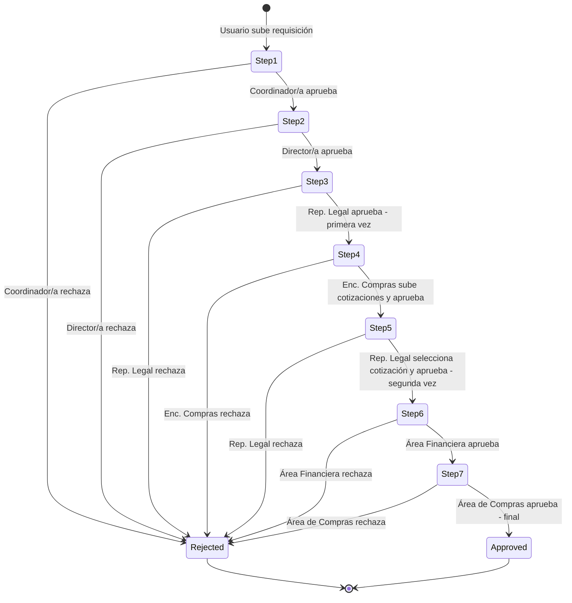
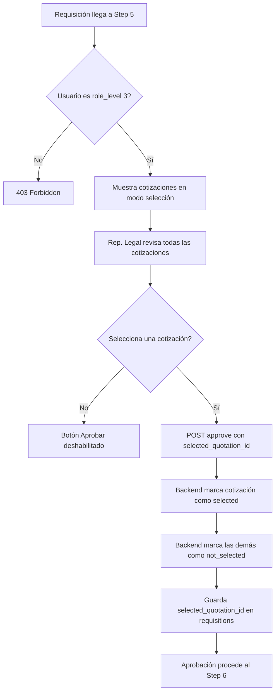

# Plan: Reestructuración del Flujo de Aprobación — 6 a 7 Pasos

> Reestructurar el workflow de aprobación de requisiciones de 6 pasos a 7 pasos, donde el Representante Legal participa dos veces, se elimina el rol Analista, se renombra Revisor/a a Área Financiera, y se agrega un nuevo rol Área de Compras.

---

## 1. Resumen del Cambio

### Flujo ACTUAL (6 pasos, 6 niveles de rol)

| Paso | `step_level` | `assigned_role_level` | Rol | Acción |
|------|-------------|----------------------|-----|--------|
| 1 | 1 | 1 | Coordinador/a de Territorio | Sube requisición + aprobación inicial |
| 2 | 2 | 2 | Director/a Programática | Aprueba |
| 3 | 3 | 3 | Representante Legal | Aprueba |
| 4 | 4 | 4 | Encargado/a de Compras | Sube cotizaciones + aprueba |
| 5 | 5 | 5 | Analista | Aprueba |
| 6 | 6 | 6 | Revisor/a | Aprobación final |

### Flujo NUEVO (7 pasos, 6 niveles de rol — un rol participa dos veces)

| Paso | `step_level` | `assigned_role_level` | Rol | Acción |
|------|-------------|----------------------|-----|--------|
| 1 | 1 | 1 | Coordinador/a de Territorio | Sube requisición + aprobación inicial |
| 2 | 2 | 2 | Director/a Programática | Aprueba |
| 3 | 3 | 3 | Representante Legal | Aprueba (primera vez) |
| 4 | 4 | 4 | Encargado/a de Compras | Sube cotizaciones + aprueba |
| 5 | 5 | 3 | Representante Legal | **Revisa cotizaciones, SELECCIONA UNA**, aprueba (segunda vez) |
| 6 | 6 | 5 | Área Financiera (antes Revisor/a) | Aprueba |
| 7 | 7 | 6 | Área de Compras (NUEVO) | Aprobación final |

### Cambios Clave

1. **Rol Analista (level 5) ELIMINADO** — reemplazado por la segunda participación del Representante Legal
2. **Rol Revisor/a (level 6) RENOMBRADO** a "Área Financiera" y pasa a ser level 5
3. **Nuevo rol "Área de Compras"** en level 6 — aprobación final
4. **Paso 5 es especial**: Representante Legal (`role_level=3`) revisa las cotizaciones y SELECCIONA una
5. **7 approval_steps** se crean por requisición en lugar de 6
6. **`assigned_role_level` en approval_steps** ahora puede repetirse (level 3 aparece en step 3 Y step 5)

---

## 2. Diagrama del Nuevo Flujo



### Flujo del Paso 5 — Selección de Cotización



---

## 3. Cambios en Base de Datos

### 3.1 Tabla `quotations` — Nueva columna `status`

```sql
ALTER TABLE quotations ADD COLUMN status TEXT NOT NULL DEFAULT 'active'
  CHECK (status IN ('active', 'selected', 'not_selected'));
```

### 3.2 Tabla `requisitions` — Nueva columna `selected_quotation_id`

```sql
ALTER TABLE requisitions ADD COLUMN selected_quotation_id INTEGER DEFAULT NULL
  REFERENCES quotations(id);
```

### 3.3 Tabla `approval_steps` — Cambiar constraint `step_level` de 1-6 a 1-7

SQLite no soporta ALTER COLUMN, se recrea la tabla:

```sql
CREATE TABLE approval_steps_new (
  id INTEGER PRIMARY KEY AUTOINCREMENT,
  requisition_id INTEGER NOT NULL,
  step_level INTEGER NOT NULL CHECK (step_level >= 1 AND step_level <= 7),
  status TEXT DEFAULT 'pending' CHECK (status IN ('pending', 'approved', 'rejected')),
  assigned_role_level INTEGER NOT NULL,
  created_at TEXT DEFAULT (datetime('now')),
  updated_at TEXT DEFAULT (datetime('now')),
  FOREIGN KEY (requisition_id) REFERENCES requisitions(id)
);
INSERT INTO approval_steps_new SELECT * FROM approval_steps;
DROP TABLE approval_steps;
ALTER TABLE approval_steps_new RENAME TO approval_steps;
```

### 3.4 Tabla `users` — Sin cambio en constraint (sigue 1-6)

### 3.5 Usuarios — Actualización

| Acción | Username actual | Username nuevo | Nombre | Level |
|--------|----------------|---------------|--------|-------|
| ELIMINAR | `analista` | — | — | — |
| RENOMBRAR | `revisor` | `area.financiera` | Área Financiera | 5 |
| AGREGAR | — | `area.compras` | Área de Compras | 6 |

---

## 4. Migración 003 — Código Exacto

### Archivo: `src/config/migrations/003_workflow_restructure.js`

```javascript
/**
 * Migration 003 — Workflow Restructure (6 → 7 steps)
 *
 * 1. Adds `status` column to quotations table
 * 2. Adds `selected_quotation_id` column to requisitions table
 * 3. Recreates approval_steps table with step_level CHECK 1-7
 * 4. Updates user roles: removes analista, renames revisor, adds area.compras
 *
 * @module migrations/003_workflow_restructure
 */

const bcrypt = require('bcryptjs');

module.exports = {
  version: 3,
  name: 'workflow_restructure',

  up(db) {
    // ── 1. Add `status` column to quotations ──────────────────────────
    const quotationCols = db.exec('PRAGMA table_info(quotations)');
    const hasStatusCol = quotationCols.length > 0 &&
      quotationCols[0].values.some((row) => row[1] === 'status');

    if (!hasStatusCol) {
      db.run(`
        ALTER TABLE quotations
        ADD COLUMN status TEXT NOT NULL DEFAULT 'active'
        CHECK (status IN ('active', 'selected', 'not_selected'))
      `);
    }

    // ── 2. Add `selected_quotation_id` column to requisitions ─────────
    const reqCols = db.exec('PRAGMA table_info(requisitions)');
    const hasSelectedCol = reqCols.length > 0 &&
      reqCols[0].values.some((row) => row[1] === 'selected_quotation_id');

    if (!hasSelectedCol) {
      db.run(`
        ALTER TABLE requisitions
        ADD COLUMN selected_quotation_id INTEGER DEFAULT NULL
        REFERENCES quotations(id)
      `);
    }

    // ── 3. Recreate approval_steps with step_level CHECK 1-7 ─────────
    db.run(`
      CREATE TABLE IF NOT EXISTS approval_steps_new (
        id INTEGER PRIMARY KEY AUTOINCREMENT,
        requisition_id INTEGER NOT NULL,
        step_level INTEGER NOT NULL CHECK (step_level >= 1 AND step_level <= 7),
        status TEXT DEFAULT 'pending' CHECK (status IN ('pending', 'approved', 'rejected')),
        assigned_role_level INTEGER NOT NULL,
        created_at TEXT DEFAULT (datetime('now')),
        updated_at TEXT DEFAULT (datetime('now')),
        FOREIGN KEY (requisition_id) REFERENCES requisitions(id)
      )
    `);
    db.run('INSERT INTO approval_steps_new SELECT * FROM approval_steps');
    db.run('DROP TABLE approval_steps');
    db.run('ALTER TABLE approval_steps_new RENAME TO approval_steps');

    // ── 4. Update user roles ──────────────────────────────────────────
    db.run("DELETE FROM users WHERE username = 'analista'");

    db.run(`
      UPDATE users
      SET username = 'area.financiera',
          email = 'area.financiera@cid.org.co',
          full_name = 'Área Financiera',
          role_level = 5,
          updated_at = datetime('now')
      WHERE username = 'revisor'
    `);

    const existing = db.exec("SELECT COUNT(*) FROM users WHERE username = 'area.compras'");
    const count = existing.length > 0 ? existing[0].values[0][0] : 0;
    if (count === 0) {
      const passwordHash = bcrypt.hashSync('cid2024', 10);
      db.run(
        'INSERT INTO users (username, email, password_hash, full_name, role_level, territory) VALUES (?, ?, ?, ?, ?, ?)',
        ['area.compras', 'area.compras@cid.org.co', passwordHash, 'Área de Compras', 6, null],
      );
    }
  },
};
```

### Registro en [`src/config/migrations/index.js`](../src/config/migrations/index.js:16)

```javascript
const migrations = [
  require('./001_initial_schema'),
  require('./002_seed_users'),
  require('./003_workflow_restructure'),  // NUEVO
];
```

---

## 5. Cambios en Modelos

### 5.1 [`src/models/ApprovalStep.js`](../src/models/ApprovalStep.js)

**Agregar constantes** al inicio del archivo:

```javascript
const STEP_TO_ROLE_MAP = {
  1: 1,  // Coordinador/a de Territorio
  2: 2,  // Director/a Programática
  3: 3,  // Representante Legal (primera vez)
  4: 4,  // Encargado/a de Compras
  5: 3,  // Representante Legal (segunda vez — selecciona cotización)
  6: 5,  // Área Financiera
  7: 6,  // Área de Compras
};
const MAX_STEP_LEVEL = 7;
```

**Cambiar [`createAll()`](../src/models/ApprovalStep.js:19)** — loop de 1-6 a 1-7 con mapeo:

```javascript
createAll(requisitionId) {
  const insertStmt = db.prepare(`
    INSERT INTO approval_steps (requisition_id, step_level, status, assigned_role_level)
    VALUES (?, ?, 'pending', ?)
  `);
  const createSteps = db.transaction(() => {
    for (let step = 1; step <= MAX_STEP_LEVEL; step++) {
      insertStmt.run(requisitionId, step, STEP_TO_ROLE_MAP[step]);
    }
  });
  createSteps();
  return ApprovalStep.findByRequisition(requisitionId);
},
```

**Exportar constantes:**

```javascript
module.exports = ApprovalStep;
module.exports.STEP_TO_ROLE_MAP = STEP_TO_ROLE_MAP;
module.exports.MAX_STEP_LEVEL = MAX_STEP_LEVEL;
```

### 5.2 [`src/models/Quotation.js`](../src/models/Quotation.js) — Nuevos métodos

**`selectQuotation(quotationId, requisitionId)`** — Marca una cotización como `selected`, las demás como `not_selected`, y actualiza `requisitions.selected_quotation_id`.

```javascript
selectQuotation(quotationId, requisitionId) {
  const quotation = Quotation.findById(quotationId);
  if (!quotation) {
    throw new AppError('Cotización no encontrada', 404, 'QUOTATION_NOT_FOUND');
  }
  if (quotation.requisition_id !== requisitionId) {
    throw new AppError('La cotización no pertenece a esta requisición', 400, 'QUOTATION_MISMATCH');
  }

  db.prepare(`
    UPDATE quotations SET status = 'not_selected', updated_at = datetime('now')
    WHERE requisition_id = ?
  `).run(requisitionId);

  db.prepare(`
    UPDATE quotations SET status = 'selected', updated_at = datetime('now')
    WHERE id = ?
  `).run(quotationId);

  db.prepare(`
    UPDATE requisitions SET selected_quotation_id = ?, updated_at = datetime('now')
    WHERE id = ?
  `).run(quotationId, requisitionId);

  return Quotation.findById(quotationId);
},
```

**`hasSelectedQuotation(requisitionId)`** — Verifica si hay cotización seleccionada:

```javascript
hasSelectedQuotation(requisitionId) {
  const result = db.prepare(`
    SELECT id FROM quotations WHERE requisition_id = ? AND status = 'selected' LIMIT 1
  `).get(requisitionId);
  return !!result;
},
```

### 5.3 [`src/models/Requisition.js`](../src/models/Requisition.js) — Nuevo `findPendingForRole()`

Reemplaza [`findPendingForLevel()`](../src/models/Requisition.js:141). Para `role_level=3`, busca en `current_approval_level IN (3, 5)`:

```javascript
findPendingForRole(roleLevel, { limit = 20, offset = 0 } = {}) {
  const { STEP_TO_ROLE_MAP } = require('./ApprovalStep');
  const matchingSteps = Object.entries(STEP_TO_ROLE_MAP)
    .filter(([_, role]) => role === roleLevel)
    .map(([step]) => parseInt(step, 10));
  const placeholders = matchingSteps.map(() => '?').join(',');

  const items = db.prepare(`
    SELECT r.*, u.full_name AS uploader_name, u.username AS uploader_username
    FROM requisitions r JOIN users u ON r.uploaded_by = u.id
    WHERE r.current_approval_level IN (${placeholders})
      AND r.status IN ('pending', 'in_review')
    ORDER BY r.created_at ASC LIMIT ? OFFSET ?
  `).all(...matchingSteps, limit, offset);

  const { total } = db.prepare(`
    SELECT COUNT(*) as total FROM requisitions
    WHERE current_approval_level IN (${placeholders})
      AND status IN ('pending', 'in_review')
  `).get(...matchingSteps);

  return { items, total };
},
```

**También actualizar [`findAll()`](../src/models/Requisition.js:14)** — usar el step mínimo del role para el filtro de visibilidad:

```javascript
if (userRoleLevel) {
  const { STEP_TO_ROLE_MAP } = require('./ApprovalStep');
  const minStep = Math.min(
    ...Object.entries(STEP_TO_ROLE_MAP)
      .filter(([_, role]) => role === userRoleLevel)
      .map(([step]) => parseInt(step, 10))
  );
  query += ' WHERE r.current_approval_level >= ? OR r.status IN (\'approved\', \'rejected\')';
  params.push(minStep);
}
```

---

## 6. Cambios en Controllers

### 6.1 [`src/controllers/approvalController.js`](../src/controllers/approvalController.js)

**Cambio 1** — Reemplazar `const MAX_APPROVAL_LEVEL = 6` ([línea 9](../src/controllers/approvalController.js:9)) con:

```javascript
const { STEP_TO_ROLE_MAP, MAX_STEP_LEVEL } = require('../models/ApprovalStep');
```

**Cambio 2** — Autorización basada en step→role mapping. En [`approve()`](../src/controllers/approvalController.js:30) y [`reject()`](../src/controllers/approvalController.js:120), reemplazar:

```javascript
// ANTES:
if (user.role_level !== requisition.current_approval_level) { ... }

// DESPUÉS:
const requiredRoleLevel = STEP_TO_ROLE_MAP[requisition.current_approval_level];
if (!requiredRoleLevel || user.role_level !== requiredRoleLevel) { ... }
```

**Cambio 3** — Lógica especial en paso 5. Antes de la transacción en `approve()`:

```javascript
if (requisition.current_approval_level === 5) {
  const { selected_quotation_id } = req.body;
  if (!selected_quotation_id) {
    throw new AppError('Debe seleccionar una cotización antes de aprobar', 400, 'QUOTATION_SELECTION_REQUIRED');
  }
  const selectedQ = Quotation.findById(selected_quotation_id);
  if (!selectedQ || selectedQ.requisition_id !== parseInt(requisitionId, 10)) {
    throw new AppError('Cotización seleccionada no válida', 400, 'INVALID_QUOTATION_SELECTION');
  }
}
```

Dentro de la transacción, antes de `ApprovalStep.updateStatus()`:

```javascript
if (requisition.current_approval_level === 5) {
  Quotation.selectQuotation(
    parseInt(req.body.selected_quotation_id, 10),
    parseInt(requisitionId, 10),
  );
}
```

**Cambio 4** — Reemplazar `MAX_APPROVAL_LEVEL` por `MAX_STEP_LEVEL` en la lógica de `nextLevel > MAX_STEP_LEVEL`.

### 6.2 [`src/controllers/dashboardController.js`](../src/controllers/dashboardController.js)

En [`getPending()`](../src/controllers/dashboardController.js:27), cambiar:

```javascript
// ANTES:
const { items, total } = Requisition.findPendingForLevel(userRoleLevel, { limit, offset });

// DESPUÉS:
const { items, total } = Requisition.findPendingForRole(userRoleLevel, { limit, offset });
```

---

## 7. Cambios en Rutas

### [`src/routes/approvals.js`](../src/routes/approvals.js)

Agregar validación para `selected_quotation_id` en la ruta POST approve ([línea 14](../src/routes/approvals.js:14)):

```javascript
body('selected_quotation_id').optional().isInt({ min: 1 })
  .withMessage('El ID de cotización seleccionada debe ser un número válido'),
```

---

## 8. Cambios en Frontend

### 8.1 [`public/js/app.js`](../public/js/app.js) — Role Names y Step Labels

Reemplazar `ROLE_NAMES_GENDERED` ([líneas 19-26](../public/js/app.js:19)):

```javascript
const ROLE_NAMES_GENDERED = {
  1: { M: 'Coordinador de Territorio', F: 'Coordinadora de Territorio', default: 'Coordinador/a de Territorio' },
  2: { M: 'Director Programático', F: 'Directora Programática', default: 'Director/a Programática' },
  3: { default: 'Representante Legal' },
  4: { M: 'Encargado de Compras', F: 'Encargada de Compras', default: 'Encargado/a de Compras' },
  5: { default: 'Área Financiera' },
  6: { default: 'Área de Compras' },
};

// Mapeo step_level → role_level para el timeline
const STEP_TO_ROLE = { 1: 1, 2: 2, 3: 3, 4: 4, 5: 3, 6: 5, 7: 6 };

// Labels por step para distinguir las dos participaciones del Rep. Legal
const STEP_LABELS = {
  1: 'Coordinador/a de Territorio',
  2: 'Director/a Programática',
  3: 'Representante Legal',
  4: 'Encargado/a de Compras',
  5: 'Representante Legal — Selección de Cotización',
  6: 'Área Financiera',
  7: 'Área de Compras',
};
```

### 8.2 [`public/js/app.js`](../public/js/app.js) — Nueva función `stepLabel()`

```javascript
function stepLabel(stepLevel) {
  return STEP_LABELS[stepLevel] || `Paso ${stepLevel}`;
}
```

Usar `stepLabel(step.step_level)` en el timeline de aprobación en lugar de `levelLabel(step.step_level)`.

### 8.3 [`public/js/app.js`](../public/js/app.js) — Lógica `canAct` actualizada

La lógica actual para determinar si el usuario puede actuar es:

```javascript
const canAct = currentUser.role_level === requisition.current_approval_level;
```

Debe cambiar a:

```javascript
const requiredRole = STEP_TO_ROLE[requisition.current_approval_level];
const canAct = currentUser.role_level === requiredRole
  && ['pending', 'in_review'].includes(requisition.status);
```

### 8.4 [`public/js/app.js`](../public/js/app.js) — UI de selección de cotización en paso 5

Cuando `requisition.current_approval_level === 5` y `canAct`:

1. Mostrar las cotizaciones con **radio buttons** para seleccionar una
2. El botón "Aprobar" está **deshabilitado** hasta que se seleccione una cotización
3. Al aprobar, enviar `selected_quotation_id` en el body del POST

```javascript
// En renderRequisitionDetail(), cuando current_approval_level === 5 y canAct:
// - Renderizar cada cotización con un radio button
// - Al seleccionar, habilitar el botón de aprobar
// - Al hacer click en aprobar, llamar:
//   API.approveRequisition(requisitionId, comments, selectedQuotationId)
```

### 8.5 [`public/js/app.js`](../public/js/app.js) — Mostrar cotización seleccionada en pasos 6-7

Para pasos posteriores al 5, mostrar cuál cotización fue seleccionada con un badge visual:

```javascript
// Si requisition.selected_quotation_id existe, marcar esa cotización con badge "Seleccionada"
// Las demás cotizaciones muestran badge "No seleccionada"
```

### 8.6 [`public/js/api.js`](../public/js/api.js) — Actualizar `approveRequisition()`

**Antes** ([línea 109](../public/js/api.js:109)):
```javascript
async function approveRequisition(requisitionId, comments) {
  return request('POST', `/approvals/${requisitionId}/approve`, { comments: comments || '' });
}
```

**Después:**
```javascript
async function approveRequisition(requisitionId, comments, selectedQuotationId) {
  const body = { comments: comments || '' };
  if (selectedQuotationId) {
    body.selected_quotation_id = selectedQuotationId;
  }
  return request('POST', `/approvals/${requisitionId}/approve`, body);
}
```

### 8.7 [`public/index.html`](../public/index.html) — Cache bust

Incrementar versión de los scripts de `?v=N` a `?v=N+1`.

---

## 9. Cambios en Documentación

### 9.1 [`ARCHITECTURE.md`](../ARCHITECTURE.md)

1. **Sección 1** — Cambiar "6 hierarchical approval roles" a "7 sequential approval steps across 6 role levels"
2. **Diagrama state machine** — Actualizar de 6 a 7 estados
3. **Tabla `users`** — Actualizar descripción de role_level 5 y 6
4. **Tabla `approval_steps`** — Cambiar "1-6" a "1-7" en step_level
5. **Tabla `quotations`** — Agregar columna `status`
6. **Tabla `requisitions`** — Agregar columna `selected_quotation_id`
7. **Sección 7** — Actualizar "6 approval_steps" a "7 approval_steps"
8. **Per-Step Logic** — Actualizar para reflejar 7 pasos y la lógica del paso 5

### 9.2 [`plans/gender-role-names.md`](../plans/gender-role-names.md)

Actualizar la tabla de Role Name Mapping:

| Level | Masculine | Feminine | Neutral/Default |
|-------|-----------|----------|-----------------|
| 5 | Área Financiera | Área Financiera | Área Financiera |
| 6 | Área de Compras | Área de Compras | Área de Compras |

(Los nuevos roles no tienen variación de género)

---

## 10. Resumen de Archivos a Modificar

### Archivos Nuevos

| Archivo | Propósito |
|---------|-----------|
| `src/config/migrations/003_workflow_restructure.js` | Migración de base de datos |

### Archivos Modificados — Backend

| Archivo | Cambio |
|---------|--------|
| [`src/config/migrations/index.js`](../src/config/migrations/index.js) | Registrar migración 003 |
| [`src/models/ApprovalStep.js`](../src/models/ApprovalStep.js) | Agregar `STEP_TO_ROLE_MAP`, `MAX_STEP_LEVEL`; cambiar `createAll()` de 6 a 7 pasos con mapeo |
| [`src/models/Quotation.js`](../src/models/Quotation.js) | Agregar `selectQuotation()` y `hasSelectedQuotation()` |
| [`src/models/Requisition.js`](../src/models/Requisition.js) | Agregar `findPendingForRole()`; actualizar `findAll()` para usar step mapping |
| [`src/controllers/approvalController.js`](../src/controllers/approvalController.js) | Importar `STEP_TO_ROLE_MAP`/`MAX_STEP_LEVEL`; cambiar autorización a step→role; agregar lógica paso 5 |
| [`src/controllers/dashboardController.js`](../src/controllers/dashboardController.js) | Usar `findPendingForRole()` en vez de `findPendingForLevel()` |
| [`src/routes/approvals.js`](../src/routes/approvals.js) | Agregar validación de `selected_quotation_id` |

### Archivos Modificados — Frontend

| Archivo | Cambio |
|---------|--------|
| [`public/js/app.js`](../public/js/app.js) | Actualizar `ROLE_NAMES_GENDERED`; agregar `STEP_TO_ROLE`, `STEP_LABELS`, `stepLabel()`; cambiar `canAct`; UI selección cotización paso 5; mostrar cotización seleccionada |
| [`public/js/api.js`](../public/js/api.js) | Agregar `selectedQuotationId` param a `approveRequisition()` |
| [`public/index.html`](../public/index.html) | Cache bust versión |

### Archivos Modificados — Documentación

| Archivo | Cambio |
|---------|--------|
| [`ARCHITECTURE.md`](../ARCHITECTURE.md) | Actualizar diagramas, tablas de schema, workflow description |
| [`plans/gender-role-names.md`](../plans/gender-role-names.md) | Actualizar tabla de roles level 5 y 6 |

---

## 11. Orden de Implementación

La secuencia recomendada, donde cada paso construye sobre el anterior:

1. **Migración 003** — Crear archivo y registrar en index.js
2. **Modelo ApprovalStep** — Agregar constantes `STEP_TO_ROLE_MAP` y `MAX_STEP_LEVEL`; actualizar `createAll()`
3. **Modelo Quotation** — Agregar `selectQuotation()` y `hasSelectedQuotation()`
4. **Modelo Requisition** — Agregar `findPendingForRole()`; actualizar `findAll()`
5. **Controller approvalController** — Cambiar autorización, agregar lógica paso 5, usar `MAX_STEP_LEVEL`
6. **Controller dashboardController** — Usar `findPendingForRole()`
7. **Ruta approvals.js** — Agregar validación `selected_quotation_id`
8. **Frontend api.js** — Actualizar `approveRequisition()` con parámetro `selectedQuotationId`
9. **Frontend app.js** — Actualizar role names, step labels, `canAct`, UI selección cotización
10. **Cache bust** — Incrementar versión en `index.html`
11. **Documentación** — Actualizar `ARCHITECTURE.md` y `gender-role-names.md`
12. **Testing** — Verificar flujo completo end-to-end con los 7 pasos

---

## 12. Reglas de Negocio — Resumen

| Regla | Dónde se aplica |
|-------|----------------|
| Step 4: al menos 1 cotización completa para aprobar | `approvalController.approve()` — ya existe |
| Step 5: debe seleccionar una cotización para aprobar | `approvalController.approve()` — NUEVO |
| Step 5: cotización seleccionada → status `selected` | `Quotation.selectQuotation()` — NUEVO |
| Step 5: demás cotizaciones → status `not_selected` | `Quotation.selectQuotation()` — NUEVO |
| Step 5: `selected_quotation_id` se guarda en requisitions | `Quotation.selectQuotation()` — NUEVO |
| Rechazo en cualquier paso es terminal | Sin cambio — ya existe |
| `role_level=3` ve requisiciones en step 3 Y step 5 | `Requisition.findPendingForRole()` — NUEVO |
| 7 approval_steps se crean por requisición | `ApprovalStep.createAll()` — MODIFICADO |
| Autorización usa mapeo step→role, no igualdad directa | `approvalController` — MODIFICADO |
| Cotizaciones son inmutables después del paso 4 | Sin cambio — ya existe |
| Cotización seleccionada es inmutable después del paso 5 | Implícito — paso 5 ya aprobado, no se puede re-seleccionar |

---

## 13. Consideraciones Especiales

### 13.1 Datos existentes

Como es un MVP con datos efímeros, la migración 003 puede ser destructiva con `approval_steps`. Las requisiciones existentes que estaban en pasos 5 o 6 del flujo viejo quedarán en un estado inconsistente. **Recomendación:** eliminar la base de datos (`data/cid_aprueba.db`) y dejar que se recree desde cero con las migraciones.

### 13.2 Sesiones activas

Los usuarios con sesión activa (JWT) que tenían `role_level=5` (Analista) o `role_level=6` (Revisor) tendrán tokens inválidos después de la migración. Deberán re-autenticarse con los nuevos usernames.

### 13.3 `quotations.updated_at`

La tabla `quotations` actual en [`001_initial_schema.js`](../src/config/migrations/001_initial_schema.js:80) no tiene columna `updated_at`. Los métodos `selectQuotation()` usan `updated_at = datetime('now')`. Verificar si la columna existe; si no, la migración 003 debe agregarla o los UPDATE deben omitirla.

### 13.4 Frontend — Timeline con 7 pasos

El timeline de aprobación actualmente renderiza 6 pasos. Con 7 pasos, verificar que el layout no se rompa visualmente. Puede necesitar ajustes CSS menores para acomodar el paso extra.